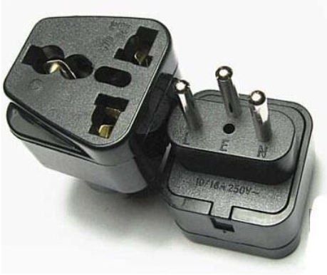

^
^

**i.必备物品（不带这些你出来干啥\~瑞士没有获取渠道**）

**证件**：护照，身份证，驾照及公证件，带齐注册所需的所有文件。
※ 中国驾照在一年内配合有效认证/公证翻译文件，在瑞士是有效的。这个“认证/公证翻译件”对于不同的租车公司来说要求不一样，有的只要翻译，有的要公证翻译，有的要具有外交效力的认证翻译。国内租租车网站上有一个“国际驾照认证件”，据说被认可度很高。
※过了第一年，需要在苏黎世交管局办理转驾照手续。转驾照需要通过一个特殊的路考(Kontrollfahrt)，重点不在汽车操控而在于对当地交规的理解。路考一旦挂科，国内驾照立即失效且不能补考，得从零开始学瑞士驾照。
**证件照**：护照规格（35\*45）5-8张。办理交通卡、签证和换护照时等情况需要。虽然证件照自动拍摄亭很普遍，但8瑞郎4张，略贵，而且拍出来巨丑
**现金**：2000左右CHF基本够用。需要注意如果是UZH新生的话请至少准备1000CHF左右的现金用于缴纳第一笔学费，因为交学费的POST似乎没法刷信用卡和银联卡，而那会你也肯定没有办出本地的银行卡
**手机**：不用多说，没了它好多事干不了，国内手机在这边使用没问题。就算本地购买签约机也需要先办理居留证，建议国内带一个备用。注意国内与中国移动或联通或电信签约的手机，或充话费送手机的手机，来到欧洲这里也许不能用3G或4G网络，只能用2G。

**银联、信用卡**：关于银联境外ATM取现，每卡每年银联取现限额为10万人民币等值外汇，每卡每天限制为1万元人民币等值外汇。“银联汇率”的瑞士法郎价格每天更新一次，约为北京时间下午16:30。注意！在国内建行或其他银行存的瑞郎在瑞士无法直接取现。建议在国内开通网银，在瑞士办好银行卡后可将国内的存款转到这边的银行卡。
※瑞士不会有银行通过邮件方式通知你账号有异常情况，任何以银行名义给你发的邮件建议统统删除

**转换插头**：瑞标和万用插头。真正居家旅行必备。不嫌少。请至少携带两个，一个日常使用一个备用。

建议搜索“瑞标”转接头。所需数量需考虑以下因素：①需转换插头的电器数量②需同时使用的电器数量③是否有耐心一个转换插头挪来挪去。
需要携带多种国内用电器的话建议顺手带一个插排

^

**ii.推荐携带（日常所需，瑞士有获取渠道，但性价比低或功能受限**）
**插线板**：搭配转换插头使用。国内带来的电器可用，瑞标和欧标的两脚插头也可用。
**电子配件**：移动硬盘，U盘，充电线，充电宝等，注意充电宝建议自备一个，瑞士本地能买到的充电宝大都贵得离谱而且质量还没有国内牌子好（而且大概率还是Made in China）
**计算器**：根据专业自行决定，Casio fx-991es plus这个级别足够。智能计算器、绘图计算器一般不允许进考场。
※有test mode的智能计算器多数情况下是允许被使用的，据观察，这边同学考试用的计算器都比Casio fx-991es plus 这个级别的要智能很多。
**眼镜**：1-2副备用。在瑞士价格较贵。墨镜在日常阳光下可满足护眼需求，上雪山时则为生存必须。爱运动的同学也推荐从国内购买泳镜。尤其是近视泳镜，苏黎世及周边边境城市都没有卖。
**日常衣物**：春秋装多带，瑞士春秋绵长气候宜人风景秀丽。冬季气温和长三角比较像，外加到处都有暖气，不用太厚的毛衣。
厚外套可以带但最多带一件即可，一方面带多了行李不好收拾，另一方面在瑞士打折季和outlets的衣服也很划算，有需要可以直接在瑞士购买。至于夏天的气温比较不稳定：14年夏天最高温度一度15度，晚上甚至要穿毛衣；22年夏天最高温度动辄30以上。所以夏装携带请自行斟酌。另外特别提醒一下，瑞士大部分建筑是没有空调的。
**常用药物**：根据自己的情况携带对应药物，另外建议携带常用药物如云南白药、腹可安、喇叭正露丸等以备不时之需。
抗生素也建议携带一些以备不时之需，因为这边的药店没有医生处方是不会售卖抗生素的，而医生非必要一般也不会开抗生素
**创可贴**：建议准备一些以防万一，在瑞士大家的课余生活经常涉及到爬山或者远足之类的，这玩意的需求量可能比你想象的大

^

**iii.可以考虑携带（不是日常生活必须，但偶尔能用上，瑞士有购买渠道**）

**旅行装洗漱用品**：到达瑞士的最初几天应急用。
**小电饭煲**：没了它煮米饭得累死，不过电饭煲在各种亚超和二手群里面一般很容易找到，实在不行去本地的小米专卖店买一个也行（千万别买本地的牌子，其匮乏且不可靠的功能堪称智障）
**床上用品**：IKEA价格相对合理，种类偏少，质量略粗糙。
**文具**：习惯用中性笔可多带笔芯。瑞士其他文具的性价比不错，小东西国内带也无妨，比如订书机、胶带等。
**电池**：有需要电池的电子产品推荐充电电池，石英手表用户可以配备同型号纽扣电池。
**小锁头**：体育馆或廉价旅馆的储存箱可用。
**隐形眼镜，隐形眼镜护理液**：不用多带，到德国购买性价比挺高的。
**个人用品**：
女生用品：日韩系化妆品（欧洲当然欧美系的产品居多）、剥离式面膜等
男生用品：剃须刀（不论手动还是电动，瑞士都比较贵）、剃头推子（理发店男士25CHF+）。
**中国风小礼品**：赠与帮助过自己的友人，也是道歉的好助手，传递爱与友情的正能量。可考虑带USB插头的随身带小风扇、礼品包装的中国筷子、中国结、剪纸、纸扇、书法、国画、中国风纸袋子（用于装礼物）等

^

**iv.爱带不带（瑞士购买和国内购买差距不大或不便携带，根据个人需求决定要不要带**）

**电脑**：有换代计划的话推荐学期初针对高校学生的Neptun项目，提供相对低价的高配置产品。下单到配送需要一段时间，建议国内带一个备用。注意高端电子产品价格一般国内更为便宜，但存在无法在这边保修的可能
**正装**：可以考虑直接去隔壁意大利定制，使用场合不多，但做Pre或者参加商业活动时总有机会用到。
**晚礼服**：同样可以在隔壁意大利搞定，可用来出席各种晚宴、舞会等，比如每年11月， 会在ETHZ举办欧洲最大学生舞会polyball。
**旗袍**：可用于文化节或正式的特殊的场合。

^

**v.千万别带（本地可以买到一模一样的，或者有入境限制**）
**各种煎锅、炒锅以及电水壶**：太重了，除了浪费你宝贵的行李额度之外没有任何用处，因为这些东西本地购买也不贵，再说德国的锅质量也好
**大电饭煲**：同上，太占位置了，有需要的话建议去二手群或本地小米购买
**肉类**：牛肉干什么的无所谓，腊肠之类的就别带了，带多了可能会导致被海关请进小黑屋喝茶
**中草药**：同上，可能会被当成违禁品
**瑞士军刀**：拜托搞搞清楚你来的是瑞士欸
