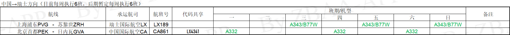

本部分最近由ZBAA-APP于2023年4月23日更新

### **1. 关于安排赴瑞行程、购买赴瑞机票的一些tips/注意事项**
#### **1.1 购买机票，需尽早、需果断**
因8-10月份是出境旺季（大批留学生开学），且洲际航班尚未完全恢复，届时赴瑞机票会极为紧张，价格亦会上涨。因此我们建议在签证办理妥当后立即选购机票，最迟也不宜晚于行前一个月（即7月中下旬-8月初）。
此外，购买机票需要果断。当看到时长、价格、落地时间都较为合适的行程时，不要犹豫，尽快决断。（无数前辈们都有过在各种机票和航司里面比来比去，挑三拣四，或者想着“再等等说不定就降价了”，结果得出结论的时候几个选择都已经售罄，最后不得不买了一张还不如之前那些选择的经历。）
#### **1.2 机票日期/时间选择：**
- 航班落地（入境）时间须在签证生效日期以后（因此不建议在获得签证前便购买机票），以避免入境时遇到麻烦
- 航班到达时间不宜过晚，以上午/下午为宜，以便为接下来的日程（手续办理、物品采购、与房东交接等）留足时间，并避免因公共交通班次减少导致难以到达市区[自苏黎世机场前往市区，如未安排接机的，一般选择乘坐火车，仅需10min即可抵达市区的主火车站（Zürich HB），再通过有轨电车等方式前往最终目的地（可提前下载Google Map和SBB Mobile/ZVV应用[ 此软件（及许多在瑞生活需要的软件）运行需要谷歌框架，使用安卓手机的同学请特别注意]，并由此查询路线&购票，详见“交通票”部分）；苏黎世的出租车价格高昂，非必要不建议乘坐]
#### **1.3 中转路线选择注意事项**

#### **1.1 购买机票，需尽早、需果断**

### **2. 机票/航班相关**
#### **2.1 关于航线选择和机票购买的一些tips/注意事项**
（适用于多数航司）
- 如可以确定回国日期，可选择购买往返票，价格会优惠许多
- 购买机票（尤其是折扣票）时，注意其行李额度和退改签条款，结合自身需求进行选择
一般情况下，同等物理舱位（经济舱、超级经济舱、公务舱、头等舱）下，价格越低，退改签条款越苛刻，能够积累的里程也越少
- 如有额外行李需求，可选择购买**留学生**票（需要凭录取通知书，学生签证等能证明留学生身份的文件购买，具体请参考航司有关规定，必要时可联系航司客服），一般可在原有行李额基础上免费增加一份额外行李。
- 如选择中转赴瑞的，需注意中转时长，稳妥起见一般以2h以上为宜，但不建议选择中转时间过长的路线
- 对于查询机票的软件，推荐：
-- 国内常用OTA平台
-- Skyscanner
-- Google Flight
后两者相比于其他同类APP无论是选择范围，排序智能程度还是可操作性方面都要优秀许多，可以帮助你更高效地完成机票的选购。此外，在通过以上第三方平台选好路线以后，不妨通过对应的航司官网再看看这条路线的价格，可能会有惊喜
- 对于查询航班状态的软件，推荐：
-- 飞常准
-- Flightradar24
- 关于选座（本条仅适用于搭乘经济舱的同学）：
-- 如希望较少被人打扰，或是希望能够看风景的，建议选择靠窗座位；对于后者，建议选座时考虑到该航司该机型的舷窗排列，避免选到“面壁座”
-- 如希望进出方便的，或希望腿部空间稍大的，建议选择靠过道座位
-- 如希望拥有较大的腿部空间的，建议选择经济舱第一排座位或紧急出口座位【一般情况下需要（/可以）提前付费购买；选择紧急出口座位的还需要在紧急情况下承担相应义务】
-- 如因为晕机等因素希望较少受到颠簸影响的，建议选择飞机中段座位（注意是飞机中段而不是经济舱中段）
-- 各航司各机型座位图可参考：飞常准app、<https://www.aerolopa.com/>等
#### **2.2 赴瑞可选路线及其特点汇总**
**2.2.1 搭乘直航航班前往瑞士**
截至4月21日，中国内地→瑞士直航航班总表如下：

其中：
- **LX189航班**，由瑞士国际航空承运，图定起降时刻按当地时间为11:20-18:50，飞行时间约为13-13.5h，
- **CA861航班**，由中国国际航空承运，图定起降时刻按当地时间为02:25-07:15，飞行时间约为11h-11.5h

目前，中国内地→瑞士直航航线航班并没有任何增加的消息。如有相关信息，我们会第一时间通告。
**2.2.2 经香港转机前往瑞士**
**2.2.3 经中东转机前往瑞士**
**2.2.4 经申根区其他城市转机前往瑞士**
**2.2.5 其他路线**

这个选择就比较五花八门了，不过可以确定的是出发地基本都在北京、上海、广州、香港这四个地方中的一个。从国内其他地方出发的话基本也要到这几个地方转。像杭州之类的部分城市虽然也有到苏黎世的机票，但选择往往没有上述四个那么丰富。
一般建议就近，结合国内城市间交通的开销选择出发地即可。四个出发地的机票在价格、耗时、转机次数等方面并没有什么特别明显的区别，一定要说有什么不同的话，广州和香港出发的航班基本都是在东南亚、阿拉伯半岛以及东欧转机，而北京和上海出发的航班有很多是在西欧转机（并没有什么大的影响）。不过两广地区的同学有条件的话最好去香港坐，选择会比广州出发多很多。
关于如何买到便宜的机票，说实在由于机票价格的大幅波动和不可预见性，我也不能给大家一个确切的答案，不过大体来说，同样日期，转机次数越多、耗时越长、出发和到达时间越晚的机票，价格越便宜。大家需要做的是结合自己的经济条件和对麻烦的接受程度，在这几个因素里面找到一个平衡点。从而买到适合自己机票（怎么感觉说了和没说似的）。当然上述规则并不绝对，偶尔你也能够找到又便宜又不麻烦的航班，这种时候就像我上面所说的那样，需要抓紧下手了，一般这种机票会被很快抢光。另外，避开8、9月份的高峰期，时间较早的机票价格也会相对便宜。但别忘了早过去的话同时也意味着要多一段时间生活在瑞士的高物价环境里了。
还有一个值得一提的点是留学生票（具体请查看各航空公司官网），如俄航、汉莎、卡塔尔和阿联酋等不少航司会专门提供留学生票，这种机票除了价格上会有一定优惠之外，往往还会提供额外的托运行李额，这点对于需要带好几个箱子的同学可以说是量身定制了，因为额外购买行李额也是一笔不小的开销（不过有时候机场的工作人员看你是留学生也会免费帮你多托运一些额度，看运气）。目前各大购票网站上如果有留学生票可购买的话都会特地标明。如果你选择的航班没有留学生票选项的话，你也可以尝试直接给相应的航空公司打电话/发邮件，并提供你的录取通知书，询问该次航班是否可购买留学生票，如果有的话直接通过航空公司订购机票。
最后，
