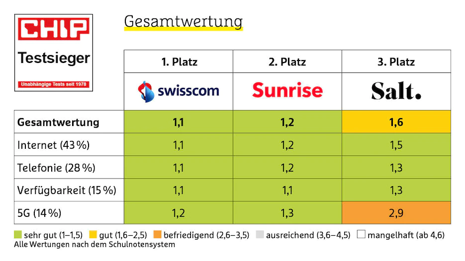

#### **1. 瑞士电信运营商简介**

瑞士三家主要的电信运营商是Swisscom，Sunrise和Salt。据CHIP和NETCHECK在2021年的测评，Swisscom总评分位居首位，Sunrise紧跟其后，位于第三位的是Salt。具体单项上：

* 传输带宽：Swisscom最大，Sunrise略低，Salt末位；
* 信号覆盖范围：Swisscom和Sunrise几乎不分伯仲（Swisscom只有不到1个百分点领先），平均都达到了98%左右。而Salt的覆盖范围低于前两者，尤其在乡村地区只有91%的覆盖率，存在无信号的几率
* 5G部署：Swisscom和Sunrise都拥有不错的部署范围，在城市中都达到了90%以上，乡村地区分别为84%和74%。而Salt的5G建设较为滞后，在城市和乡村都只有10+%部署。值得注意的是，Sunrise拥有最快的5G网速，而Swisscom由于大范围使用DSS技术，因此实际速率和4G并无太大差别；
* 通话：Swisscom和Sunrise几乎平起平坐。在通话质量和通话连接速度上，Sunrise更好一些。

**综上，Swisscom和Sunrise的综合实力不分上下，Salt略逊于前两者**。

此外，三大运营商除了同名品牌外，也有许多**子品牌**以丰富自己的产品与服务，子品牌使用运营商的通信设施。如Swisscom有wingo、Migros Budget Mobile、Coop Mobile、Lycamobile， Sunrise有Lebara、Yallo、Swype等。

> <https://www.chip.de/artikel/Handy-Netztest-Schweiz-Swisscom-Sunrise-und-Salt-im-Test_184173323.html>

^

#### **2. Prepaid和Postpaid**

瑞士电话卡分为Prepaid Card（预付卡）和Postpaid Card（合约卡），目前瑞士约80%的用户均为Postpaid Card（合约卡）。

两种电话卡各有千秋。Prepaid卡和国内的电话卡模式类似，先充值后使用，如果余额不足，服务便会被终止。Prepaid卡缺点是相同服务下，Prepaid的价格通常会比Postpaid卡贵，且选择种类较少。Postpaid卡一般会有丰富的套餐选项，且价格吸引人。Postpaid卡仅针对在瑞士合法居留的人，即收到Residence Permit（居留卡）后才能申请，且一般合约最低期限为12个月。

在瑞士，两种电话卡均需实名才能购买。

^

#### **3. 购卡套餐**

关于每家公司的套餐，大家可在官网查看，根据自己的需求选择：

Sunrise → <https://www.sunrise.ch/de/home>
Swisscom → <https://www.swisscom.ch/de/privatkunden.html>
Salt → <https://www.salt.ch/en>

但是，一个一个去官网对比套餐真的好麻烦呀\~

对此，苏黎世学联专门联系了瑞士老牌运营商Sunrise，并为大家争取了学联专属福利和优惠，为大家量身定制最优选卡购卡路径，可以大大减轻小伙伴们的选择困难并节约话费开支。

^

#### **4. 学联专属电话卡福利介绍**

**1. Sunrise Lebara Prepaid Card**

从2023年初开始，学联从Sunrise运营商处为新生争取了原价49瑞郎的Suinrise Lebara Prepaid电话卡骨折价福利。该Prepaid卡包含：

* Europe MAX Prepaid套餐（原价39瑞/4周，学联有专属前4周免费福利，立省39瑞），套餐具体内容为：

  1. 瑞士境内无限流量（前四周40GB高速，之后每四周是20GB高速，高速用完后是限速256kbps的无限流量）
  2. 瑞士境内以及瑞士向欧洲无限通话
  3. 世界范围无限短信

* 以及10瑞郎的预存款（Credit）

现在，新生可凭录取邮件/注册证明/学生卡（任一文件即可），**仅需10瑞预存费（Credit）即可获得这张总价值49瑞郎的Prepaid卡**。

^

**2. Sunrise Lebara Postpaid Card**

该选项不仅面向刚来瑞士的新生，还面向想要更换高性价比套餐的老生。这些套餐几乎均为Sunrise的平替，除品牌名称不同外，其具体内容和Sunrise其它产品几乎一样。

由Prepaid卡（包括Lebara和其它品牌Prepaid）或其它品牌Postpaid卡转为Sunrise Lebara Postpaid（携号转卡），**现仅需0瑞或10瑞激活费（Activation Fee**）。若选择12月合同，可**免去**59瑞Activation Fee；若选择0月合同，**仅需**10瑞Activation Fee即可实现转卡。**转卡后，可享受Lebara Postpaid Card各套餐的最低价**：

^

^

以上套餐中，根据大多数留学生日常需求，我们更推荐前三种套餐：**Data Abo**, **Swiss Flat Abo** 和 **Swiss L Abo**。

综上，作为新生的您**最少只需10瑞郎即可享受四周Prepaid卡套餐和Postpaid卡激活服务**，而市场上这一切通常需要耗费100瑞郎及以上（例如：您直接选择Sunrise Prepaid，一个月费用为75瑞郎，此外激活Postpaid需收取55瑞激活费，此时费用合计130瑞郎）。此外，通过学联专属福利，您还可以全年任何时刻都享受Postpaid卡套餐最低价。

^

#### **5. 三步即可享受学联专属电话卡福利**！

1\. 扫描下方微信小程序码登记预约，建议预约**落地后当日或第二天**的开卡服务：

2\. 审核通过后在预约时间前往预约地址线下开卡或转卡（由于瑞士法律规定，购买Prepaid和Postpaid须真人监督完成注册，故必须线下开卡和转卡）；

3\. 缴纳极少预存费/激活费，即可获得Lebara Prepaid卡或Postpaid卡。

^

***

**义务范围声明**：
Sunrise YOL为学联提供有极大折扣和让利的Prepaid和Postpaid卡，并委托学联进行身份控制（Identity Control）。学联仅负责审核身份并激活Prepaid卡和转Postpaid卡。任何有关运营商的疑问及产品相关问题，请联系运行商客服，学联无法为此提供进一步的支持。
