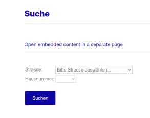
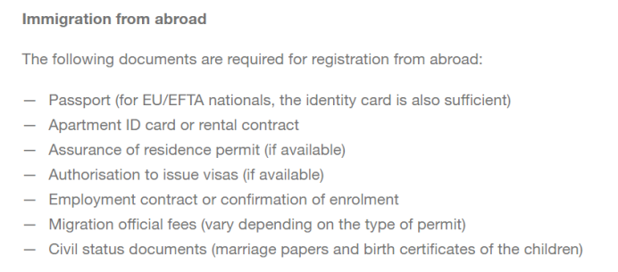

* [查询所属Kreisbüro](https://www.stadt-zuerich.ch/prd/en/index/bevoelkerungsamt/Contact_Information_and_Opening_Hours/district_office_kreisbuero.html)

下拉到搜索（Suchen）

输入住址，找到对应Kreisbüro

^

* 材料准备

护照、租房合同、学校录取通知或注册证明、相关费用

^

* 预约录指纹

Kreisbüro工作人员会提供可选的指纹录取时间，选择时间到移民局录取指纹。预约时间后可在预约单提供的网站上更改时间。

^

* 临时居留证

用于办理postpaid电话卡、瑞士银行卡等。
