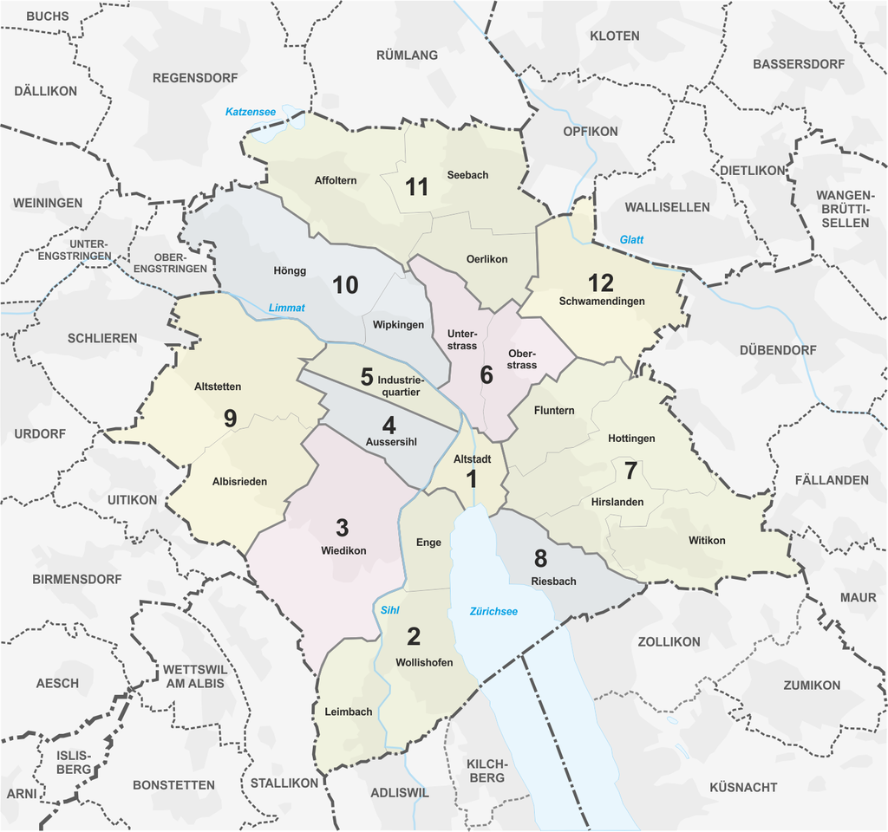

> [success] 本篇贡献：田竹仝，陈雨航，赵逸飞，杨锦涛

> [warning] 本篇涉及大量新适用的政策，仅供参考。

#### **1. 苏黎世州的住址申报体系介绍**

（本章节内容2023年6月12日起适用）
本章节涉及诸多专有翻译，为便于使用搜索引擎检索及与工作人员交流，将非地名的翻译列表如下：

| 本文使用的中文译名          | 对应的德语单词                                                      | 对应的英语单词（如有）                                                                        |
| ------------------ | ------------------------------------------------------------ | ---------------------------------------------------------------------------------- |
| 苏黎世州               | Kanton Zürich                                                | Canton of Zurich                                                                   |
| 苏黎世市 / 苏黎世市区       | Stadt Zürich                                                 | City of Zurrich                                                                    |
| 市县                 | Gemeinde                                                     | Community                                                                          |
| 居委会（2023年6月12日起撤销） | Kreisbüro                                                    | District Office                                                                    |
| 人口登记处              | Personenmeldeamt&#xA;Einwohnerkontrolle&#xA;Einwohnerdienste | Residents' Registration Office&#xA;Residents' registration&#xA;Residents' Services |
| 住址申报               | anmelden                                                     | register                                                                           |
| 住址变更               | Addresseänderung                                             | change of residential address                                                      |
| 住址注销               | abmelden                                                     | de-register                                                                        |
| 报到证明               | Meldebestätigung                                             | Confirmation of registration                                                       |
| 居留证                | Aufenthaltstitel                                             | residence permit                                                                   |

^

地名的翻译在正文中以括号形式列明。
此外，本章节所称的“苏黎世郊区”特指属于苏黎世州但不属于苏黎世市的地区，详见下图：

其中，彩色部分是苏黎世市，灰色部分即为苏黎世郊区。

^

> [warning] **背景介绍**
> 2023年6月12日起，苏黎世市区12个区的7个居委会重组为3个人口登记处（详见：[苏黎世市政府发布的相关消息](https://www.stadt-zuerich.ch/prd/de/index/ueber_das_departement/medien/medienmitteilungen/2023/maerz/230314a.html)），分别为：
>
> * 南城人口登记处（Personenmeldeamt Zürich Süd）
>   地址：Stadthausquai 17, 8001 Zürich（市政厅）
>   电话：*待添加*
>   网站：*待添加*
> * 北城人口登记处（Personenmeldeamt Zürich Nord）
>   地址：Hofwiesenstrasse 370, 8050 Zürich（Oerlikon火车站）
>   电话：*待添加*
>   网站：*待添加*
> * 西城人口登记处（Personenmeldeamt Zürich West）
>   地址：Hohlstrasse 35, 8004 Zürich（Helvetiaplatz）
>   电话：*待添加*
>   网站：*待添加*
>
> 重组后，市区范围内绝大多数业务均实现免预约的全市通办，本章节已按此更新。**苏黎世郊区的人口登记处（以及各区的债务办）不受本次重组的影响**。

***

**瑞士有着严格的住址申报制度，所有居民均有义务向政府申报自己的住址，其中新迁入的人员必须在抵达后14天内进行申报**。相关法律法规见：[Gesetz über das Meldewesen und die Einwohnerregister (MERG)](http://www2.zhlex.zh.ch/appl/zhlex_r.nsf/0/37FA9D3FAA0D5447C1257F1D004A8834/$file/142.1_11.5.15_91.pdf)（14天内未找到可供申报的住所的，也必须前往南城人口登记处说明情况请求延期，避免成为“黑户”）

**具体如下**：
**1. 对于从瑞士以外的国家迁入苏黎世州的人员（即首次在苏黎世州办理申报的，所有从国内首次前来苏黎世留学的同学均属此类**）：

* 如居住地在苏黎世市区的，必须于抵达苏黎世后14天内**凭**[预约](https://www.etermin.net/personenmeldeamtsued)**前往南城人口登记处**进行住址申报
* 如居住地在苏黎世郊区的，必须于抵达苏黎世后14天内前往所在区县的人口登记处进行住址申报，具体请参见所在区县的人口登记处官网

**2. 对于从瑞士其他地区迁入苏黎世州的人员**：

* 迁入苏黎世前，须确保已在原居住地注销
* 如居住地在苏黎世市区的，必须于抵达苏黎世后14天内前往市区任一人口登记处进行住址申报
* 如居住地在苏黎世郊区的，必须于抵达苏黎世后14天内前往所在区县的人口登记处进行住址申报

如不明确自己所住的地点是属于市区还是郊区的，可

* 直接询问房东或室友，或
* 通过地址判定：如地址邮编为“Zürich”字样则代表该地址在市区，如为其他字样（如”Kloten“”Winterthur“等）则代表该地址在郊区。

^

#### **2**. **首次办理住址申报所需材料**

根据[苏黎世市政府相关要求](https://www.stadt-zuerich.ch/prd/de/index/bevoelkerungsamt/umziehenmelden/zuzug.html)，参考[ETH的相关介绍](https://ethz.ch/de/studium/international/nach-ankunft/aufenthaltsbewilligung.html)，从瑞士以外的国家迁入苏黎世州的人员在首次办理住址申报时须准备以下材料：

* 护照原件
* 租房合同原件（如果你是转租合同，需要把二房东手里的原始合同也一起带过去，且最好二房东陪同前往）
* 学期注册确认（Erweiterte Immatrikulationsbestätigung/Enrolment confirmation）

同时，还需**带足200瑞郎**用于缴费（报到证明：40瑞郎；居留卡制证：142瑞郎；以及其它可能费用；现金/刷卡均可）。

^

#### **3**. **预约办理居留卡**

新迁入苏黎世的人员在按上述流程完成首次住址申报后，还需要现场预约办理居留卡，此项会在人口登记处的工作人员帮助下进行。预约完成后会获得预约单，须凭预约单在规定的时间前往移民局办理居留卡（见[28 居留卡办理](28移民局录指纹.md)）。
**关于时间选择**： 根据自身情况选择一个大致合适的时间即可，后期即使计划有变，亦可通过预约单上提供的网站更改时间。

^

#### **4**. **报到证明**（**Meldebestätigung**/**Confirmation of registration**）

新迁入苏黎世的人员在完成住址申报后会获得一张”报到证明“（一张含有个人信息和移民局盖章的A4纸，范例见:attachment[MBDOP.pdf]{src=".topwrite/assets/MBDOP.pdf" size="490.83 kB"}），其在大多数场合与居留证等效（但办理Postpaid电话卡仍然需要居留证）。
凭该报到证明即可前往银行办理瑞士本地的银行卡（见[26 瑞士银行卡](26瑞士银行卡.md)）。
虽然相比于正式的居留证，这张证明使用频率相对较低，但是也应**妥善保管**（即使已获得正式居留卡）。例如，[办理地址变更](https://www.stadt-zuerich.ch/prd/de/index/bevoelkerungsamt/umziehenmelden/umzug.html)时便需要用到这张报到证明上的参考号（具体根据所选报告方式有所不同）。

^

#### **5**. **住址变更申报**

（本章节后期将复制/移动至[03 生活相关](03生活相关.md)部分）
当住址发生变更时，同样需要进行申报。目前，苏黎世市区已经引入了[E-Umzug平台](https://www.stadt-zuerich.ch/prd/de/index/bevoelkerungsamt/onlineschalter/eumzug.html)供居民在线申报地址变更。但对于尚未接入[E-Umzug平台](https://www.stadt-zuerich.ch/prd/de/index/bevoelkerungsamt/onlineschalter/eumzug.html)的苏黎世郊区，仍需申报人**亲自前往**对应的人口登记处线下办理申报。
在任何情况下，申报人都可以选择前往对应的人口登记处线下办理申报。线下办理申报应携带：护照、居留证（如有）、原有的报到证明、新的租房合同以及足量资金等。

^

**情况一：苏黎世市区→苏黎世市区**
参考：[Umzug in der Stadt](https://www.stadt-zuerich.ch/prd/de/index/bevoelkerungsamt/umziehenmelden/umzug.html)
须在搬迁完成前14天至搬迁完成后14天期间

* 前往市区任一人口登记处（该项业务为**全市通办**）
* 或在线通过[E-Umzug平台](https://www.stadt-zuerich.ch/prd/de/index/bevoelkerungsamt/onlineschalter/eumzug.html)

办理住址变更申报。

^

**情况二：苏黎世郊区→苏黎世郊区（相同区县**）
须在搬迁完成后14天内

* 前往居住地所在区县的人口登记处
* 或在线通过[E-Umzug平台](https://www.stadt-zuerich.ch/prd/de/index/bevoelkerungsamt/onlineschalter/eumzug.html)，如适用

办理地址变更申报。

^

**情况三：苏黎世郊区→苏黎世市区**
须在离开原居住地后14天内前往原居住地所在市县的人口登记处办理注销，再在新居住地的人口登记处申报新的住址。
如原居住地所在市县支持[E-Umzug](https://www.stadt-zuerich.ch/prd/de/index/bevoelkerungsamt/onlineschalter/eumzug.html)的，也可在线办理。在线办理完成的，无须再前往市区的人口登记处线下办理申报。

^

**情况四：苏黎世市区→苏黎世郊区**
须在离开苏黎世市后14天内前往市区任一人口登记处办理注销（无须预约），再在新居住地的人口登记处申报新的住址。
如新居住地所在市县支持[E-Umzug](https://www.stadt-zuerich.ch/prd/de/index/bevoelkerungsamt/onlineschalter/eumzug.html)的，也可在线办理。在线办理完成的，无须再前往新居住地的人口登记处办理申报。

^

**情况五：苏黎世郊区→苏黎世郊区（不同区县**）
须在离开原居住地后14天内前往原居住地所在市县的人口登记处办理注销，再在新居住地的人口登记处申报新的住址。
如原居住地和新居住地所在市县均支持[E-Umzug](https://www.stadt-zuerich.ch/prd/de/index/bevoelkerungsamt/onlineschalter/eumzug.html)的，也可在线办理。在线办理完成的，无须再前往新居住地的人口登记处办理申报。

^

#### **6. 第三方申报义务（Drittmeldepflicht**）

（本章节后期将复制/移动至[03 生活相关](03生活相关.md)或其他对应部分）
根据苏黎世法律法规，出租人（房东/中介/二房东）在房屋出租情况有变更时（即：原承租人搬出或有新的承租人搬入时等）需向人口登记处报告房屋出租情况变动。在实际操作中，这往往与**新承租人（包括转租租客）的地址申报**合并进行。苏黎世市的有关政策可参见：[Stadt Zürich Drittmeldepflicht](https://www.stadt-zuerich.ch/prd/de/index/bevoelkerungsamt/umziehenmelden/drittmeldepflicht.html)

^

#### **7**. **住址注销**

（本节后期将复制/移动至[03 生活相关](03生活相关.md)部分；届时本部分名称亦应进行对应修改）
根据瑞士相关法律法规，居民离开现居住市县（前往其他市县居住）的，或居民不再居住在瑞士的（如完成学业归国），均须办理住址注销。

* **对于前者（离开现居住市县，前往其他市县居住的**）：
  须在离开现居住市县后14天内前往现居住地对应的人口登记处，凭护照、居留证、原有的报到证明办理注销。如现居住地所在市县和新居住地所在市县均支持[E-Umzug](https://www.stadt-zuerich.ch/prd/de/index/bevoelkerungsamt/onlineschalter/eumzug.html)的，也可在线办理。
* **对于后者（离开瑞士的**）：
  （有待核实：该项业务在市区是否通办）
  须在离开瑞士前30天内前往现居住地对应的人口登记处，凭护照、居留证、原有的报到证明办理注销，同时还需要缴纳20瑞郎的注销费用。

此外，短期离开瑞士的，如离开时长短于3个月的，无须进行任何操作；离开时长介于3个月至6个月之间的，原则上需要进行在线申报离境情况。离开时长超过6个月的，原则上需要前往居住地的人口登记处申报离境情况。关于苏黎世市的短期离境申报可参考：[Stadt Zürich Temporäre Landesabwesenheit](https://www.stadt-zuerich.ch/prd/de/index/bevoelkerungsamt/umziehenmelden/temporaerelandesabwesenheit.html)
