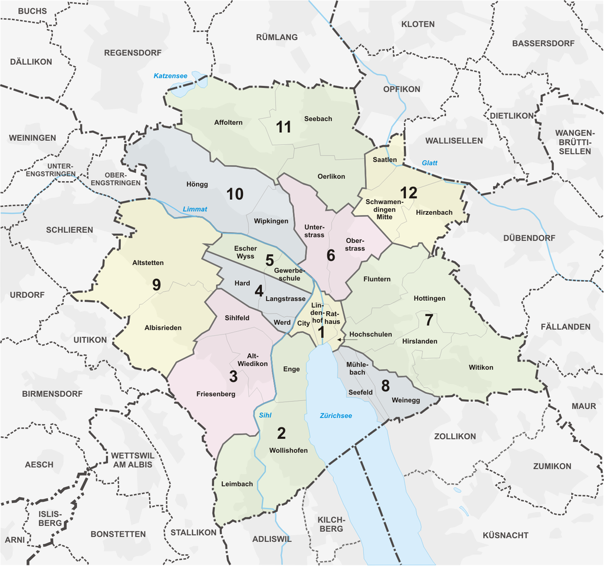

#### **1. 查询所属居委会**
*本章节所称“居委会”，在苏黎世市区（下图中彩色部分）叫做“Kreisbüro”（3、4、5、6、9、10、11、12区）或者“Personenmeldeamt”（1、2、7、8区），在苏黎世郊区（下图中白色部分）叫做“Einwohnerkontrolle”，为便于表述，下文在不需要区分的情况下将“Kreisbüro”“Personenmeldeamt”统称为“Kreisbüro”，将“Kreisbüro”“Personenmeldeamt”“Einwohnerkontrolle”统称为“居委会”。*

^
**抵达苏黎世后14天内，必须向住址所在地的居委会报到**（如14天内未租到房的，也需要前往暂住地址的居委会说明情况请求延期，避免成为“黑户”，具体请参见[“落地事项”部分](<02落地事项.md>)）。含此在内的所有业务都必须到住址所在地的居委会办理（苏黎世不允许跨区办理业务），关于自己的住址具体对应哪一个居委会，可：
* 直接询问房东/同住租客（推荐）
* 如居住在市区，可通过市政提供的[查询系统](<https://www.stadt-zuerich.ch/prd/en/index/bevoelkerungsamt/Contact_Information_and_Opening_Hours/district_office_kreisbuero.html>)查询自己的住址所对应的Kreisbüro（不要想当然地直接去最近的Kreisbüro，笔者租的第一个房子刚好处在两个区划的边界上面，结果对应的Kreisbüro反而就是大老远的一个）：
下拉到搜索（Suche）

输入住址，即可找到对应的Kreisbüro。
各个Kreisbüro的地址、联系方式等请参见查询系统（链接见上文）。
* 如居住在郊区的，可直接通过地址全名看出（如住址为 XX Strasse XX, 8058 Kloten则代表该地址在Kloten地区，需要到Kloten的Einwohnerkontrolle办理报到
各区的Einwohnerkontrolle的地址、联系方式等请参见：[Ab- und Anmelden bei der Wohngemeinde– online oder persönlich](<https://www.ch.ch/de/wohnen/umzug/ab-und-anmelden-bei-der-wohngemeinde/#bei-der-neuen-gemeinde-anmelden>)（需要手动填入地区名称方可查到对应的Einwohnerkontrolle信息；亦可直接通过Google查询）

^

#### **2. 材料准备**

原则上，报到不要求提前预约。但是，如你居住在1/2/7/8区，我们强烈建议你[提前预约](<https://www.stadt-zuerich.ch/prd/de/index/bevoelkerungsamt/kontakt-oeffnungszeiten/kontakte-und-oeffnungszeiten-pma/terminvereinbarung.html>)以缩短等待时间，居住在其他地区的也可以按需进行预约，有提前预约的人员在居委会会有专门窗口。
报到时，请准备好你的护照、租房合同、入学注册证明，同时带足200瑞郎用于缴纳注册费，具体费用视具体情况会有所不同。

^

#### **3**. **预约录指纹**

完成基本的注册流程之后，居委会的工作人员会帮助你选择预约时间到移民局录指纹（以及申请正式的居留卡）。大概选一个合适的时间即可，就算之后临时有变故也可以在预约单提供的网站上更改时间。

^

#### **4**. **临时居留证(Meldebestätigung)**

在居委会报到后，工作人员会给你一张临时居留证（一张含有你个人信息和移民局盖章的A4纸，范例见:attachment[MBDOP.pdf]{src=".topwrite/assets/MBDOP.pdf" size="490.83 kB"}）。相比于正式的居留卡，这张证明使用频率相对较低。但也**请妥善保管**（含获得正式居留卡之后），因为这会你就可以用它办理瑞士本地的银行卡了，包括一张储蓄卡以及一张Prepaid（即额度为0的信用卡，需要提前充值才能使用）/Credit卡。
此外未来如果需要[搬家（办理地址变更）](<https://www.stadt-zuerich.ch/prd/de/index/bevoelkerungsamt/umziehenmelden/umzug.html>)，在向政府报备时也需要用到这张临时居留证（上的参考号）（具体根据所选的报备方式有所不同）。