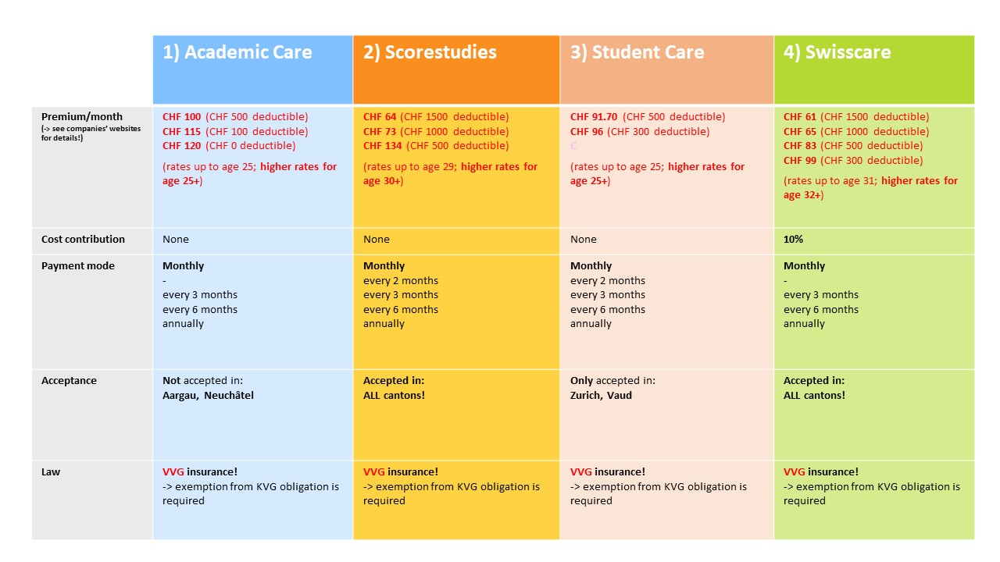

以下信息资料主要来自ETH官网相关页面

> <https://ethz.ch/de/studium/international/nach-ankunft/krankenversicherung/faq-krankenversicherung.html><https://ethz.ch/de/studium/international/nach-ankunft/krankenversicherung/non-eu.html>

^

#### **1. 强制保险义务**

**健康保险在瑞士是强制性的吗**？
是的。任何在瑞士逗留超过3个月的人都必须购买健康保险。确保你有足够的保险是你自己的责任。

^

**如果我在3个月内没有购买健康保险会怎样**？
你将被强制投保，也就是说，你将被当局分配到一个健康保险基金。这时，每月的保险费通常是**几百瑞士法郎**——不要错过3个月的最后期限!

^

**如果我在3个月后才投保健康保险，我可以省钱吗**？
不能，保险合同必须追溯到入境之日。   

^

**如果我在投保健康保险之前生病或发生事故会怎样**？

你在事故/疾病发生后选择的保险将追溯到你。所有的健康保险公司都有义务将你纳入基本保险，而无需进行健康检查。如果你想购买学生保险套餐（根据VVG），我们建议你在抵达后尽快办理。

^

**我可以在出发前申请瑞士健康保险吗**？

不可以，你应该等到你到达瑞士并申请了居留证之后再申请。然后，你居住地的主管部门会通知你医疗保险的义务。

如果你住在苏黎世市，当你在区政府登记居留证时，你会收到一封关于苏黎世强制医疗保险的信息函。请遵循信中的指示。请参考样本信:attachment[sample-letters.pdf]{src=".topwrite/assets/sample-letters.pdf" size="1.75 MB"}

如果你不是住在苏黎世市，程序因市镇的不同而不同。当你注册居留证的时候，你也应该询问那里关于医疗保险的通常程序。

^

**我想了解更多关于瑞士医疗保险的信息。我在哪里可以得到更多信息**？

联邦公共卫生局提供了一本内容非常丰富的小册子:attachment[broschuere-sie-fragen-wir-antworten-d.pdf]{src=".topwrite/assets/broschuere-sie-fragen-wir-antworten-d.pdf" size="377.12 kB"}

^

#### **2. 它国保险**

**我的私人健康保险是否被瑞士当局承认**？

如果您的健康保险1）符合法律要求，2）具有与瑞士基本保险（KVG）相同的保障范围，3）您的保险公司愿意在 "表格A "上签字盖章，您就可以在瑞士免于参加强制性健康保险。请遵循我们网站上的说明。

^

#### **3. 豁免强制保险义务**

**抵达瑞士后3个月内**，你需要申请豁免。

^

**提交豁免申请后**

你必须在到达瑞士后3个月内提交豁免申请。但是，你不一定要在3个月内收到关于豁免的最终决定。通常情况下，决定会晚一些。在这段时间内，如果你已经购买了瑞士学生健康保险，你仍然是被保险人，必须支付保险费。

如果你居住的城市对你的强制保险进行威胁，请与ETH联系。

^

**豁免的期限**

豁免期为3年，确切的日期可以在你的确认信中找到，你会通过电子邮件从卫生局收到。请在你的日历上记下这个日期，并确保你在第一个豁免期到期之前申请新的豁免。程序是一样的。豁免的最长期限是6年。6年后，你将不得不购买 “正常”的KVG保险。

^

> **我在3个月前申请豁免强制健康保险，但仍未收到决定。我必须做什么**？
> 请等待。在处理豁免申请方面有很大的延迟——可能需要9个月的时间才会收到答复！请等待！如果你被居住地的市政府威胁要参加强制保险，请联系我们。
>
> **我必须在3个月内收到关于豁免强制保险的决定吗**？
> 不，你只需要在入境后3个月内申请豁免。在大多数情况下，决定会晚一些。在这段时间内，你仍然有保险，而且还必须支付保险费（如果你已经购买了学生保险）。

^

#### **4**. **国际学生的保险选择**

**是否有提供足够保险的廉价学生套餐**？

是的，有几家公司以合理的价格为国际学生提供套餐。要了解更多信息，请访问[ETH国际学生健康保险网页](https://ethz.ch/de/studium/international/nach-ankunft/krankenversicherung/non-eu.html#par_textimage_1480546543)。如果你不确定，你可以联系[交流办公室](https://ethz.ch/de/studium/non-degree-angebote/austausch-und-gaststudium.html)（如果你是交流生）或[国际学生办公室](https://ethz.ch/de/studium/international.html)（如果你是本科生或硕士生）。

^

**国际学生的健康保险选择**：

^

！！国际学生的健康保险套餐不是根据 "联邦健康保险法"（KVG）运作的，而是根据 "联邦保险合同法"（VVG）。因此，**你必须在投保后申请豁免KVG强制健康保险**！！

> The health insurance packages for international students do not operate under the Federal Health Insurance Act (KVG), rather according to the "Federal Insurance Contract Act" (VVG) law. Therefore, in case you **take one of the packages**, you must [apply for an "exemption from the Swiss health insurance obligation](https://ethz.ch/de/studium/international/nach-ankunft/krankenversicherung/befreiung.html) according to the KVG law".

^

**各产品具体报价可在ETH相关网站查看**：

<https://ethz.ch/en/studies/international/after-arrival/health-insurance/nicht-eu.html>

^
^

5\. 豁免

^
^
^
