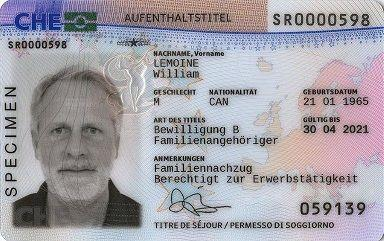

*与[“居委会报到”部分](<25居委会报到.md>)相同，本章节所称“居委会”，在苏黎世市区叫做“Kreisbüro”（3、4、5、6、9、10、11、12区）或者“Personenmeldeamt”（1、2、7、8区），在苏黎世郊区叫做“Einwohnerkontrolle”，为便于表述，在不区分二者的情况下，统称其为“居委会”。*
^
在居委会完成注册后，需要前往苏黎世移民局办理居留卡（DE: Aufenthaltsbewilligung; EN: Residence Permit），才算正式完成整个注册流程。

^

具体的时间你在居委会进行注册时工作人员会帮你预约，需要按照预约时间前往以下地址：
**移民局地址**：[Berninastrasse 45, 8090 Zürich](https://goo.gl/maps/CDzxUoomjsara83c7)

^

此外，如希望咨询移民局的，其联系方式如下：
**移民局网上联系表格**：[Kontaktformular Migrationsamt](<https://www.zh.ch/de/migration-integration/kontaktformularmigrationsamt.html>)
通过该表格联系移民局，尤其是通过此方式提交材料审批的，移民局都会等审批完成后再回复，其耗时可能较长，因此必要时可拨打电话咨询审批进度。
**移民局电话**: +41 43 259 88 00（瑞士时间星期一-星期五 08:00-12:00、13:00-16:30可用）
拨打该电话，有很大概率会提示“所有雇员正忙，请稍后”，此时可耐心等待；如等待较长时间仍未接听的，可尝试挂断并再次拨打，并在再次拨打时切换服务语言（如先前选择英语，第二次则可选择德语；无需担心语言不通问题，至少德语和英语岗位上的客服人员都熟练掌握这两种语言）。如仍然无效的，建议等到其下次开始上班时间拨打。

^

**需要携带的材料**：
（具体请参考你在居委会获得的预约单，可能会有所不同）

※护照
※一张护照尺寸的照片
※学校开具的在读证明（DE: Immatrikulationsbestätigung; EN: Enrolment Confirmation)
※租房合同
※Kreisbüro注册证明（Meldebestätigung，见[“居委会报到”部分](<25居委会报到.md>)以及预约单
※100瑞郎左右的手续费（刷卡现金均可）
※21000瑞郎的存款证明（与办理签证一样需要存入指定银行，见:attachment[beh.pdf]{src=".topwrite/assets/beh_1682637418454.pdf" size="281.56 kB"}）

^

首次办理需要录指纹+拍照，全程按工作人员指导完成即可。

^

在办理完成一段时间后（视申请人数以及移民局雇员的工作效率，时间从几周到一两个月都有可能）你会以挂号信形式收到居留卡，注意需要确保邮箱上有本人姓名才能收到信件。
一般，在瑞留学生（包含本科、硕士、博士）获得的居留卡是B类，其样卡见下：

其中，居留卡背面包含有“ZEMIS Nr.”和“Kant. Referenz”，这两个号码在办理诸多业务时（如：通过Kontakt Formular或电话联系移民局）都需要提供。
一般地，在瑞留学生获得的居留卡有效期为1年，临近到期时移民局会向你致信（Verfallsanzeige B，此处B对应居留证类型）要求你办理延期，届时按照信中要求，携带相关材料（信中会有说明）到对应的居委会办理即可。根据相关要求，办理延期时账户内余额不得低于21000瑞郎（即：不允许使用先前办理签证时使用的存款证明来办理延期）。关于办理延期可参考：[Verlängerung des Aufenthalts B](<https://www.stadt-zuerich.ch/prd/de/index/bevoelkerungsamt/umziehenmelden/internationale-kundschaft/verlaengerung_des_aufenthals_b.html>)
^

参考网址：
<https://www.zh.ch/de/migration-integration/einreise/einreise-ohne-erwerbstaetigkeit-fuer-drittstaatsangehoerige.html>
^
<https://ethz.ch/content/dam/ethz/main/continuing-education/Merkblaetter/Factsheet_Visum_en.pdf>
