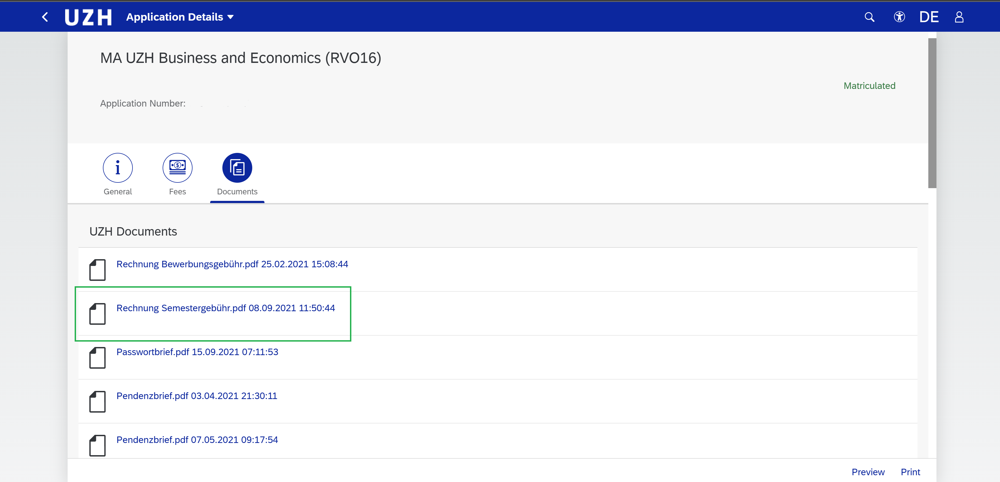
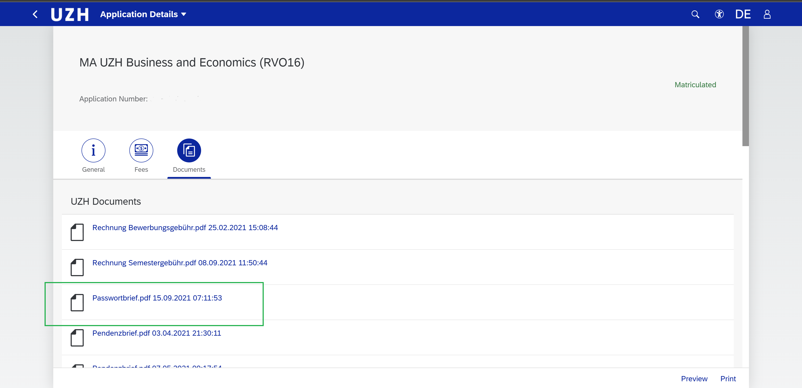
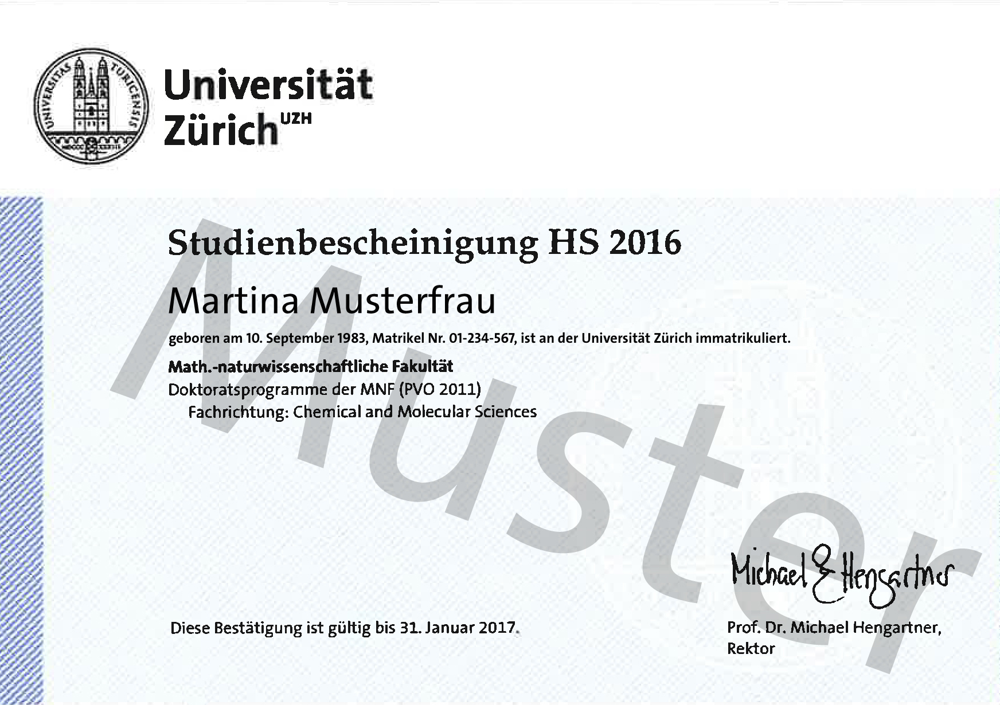
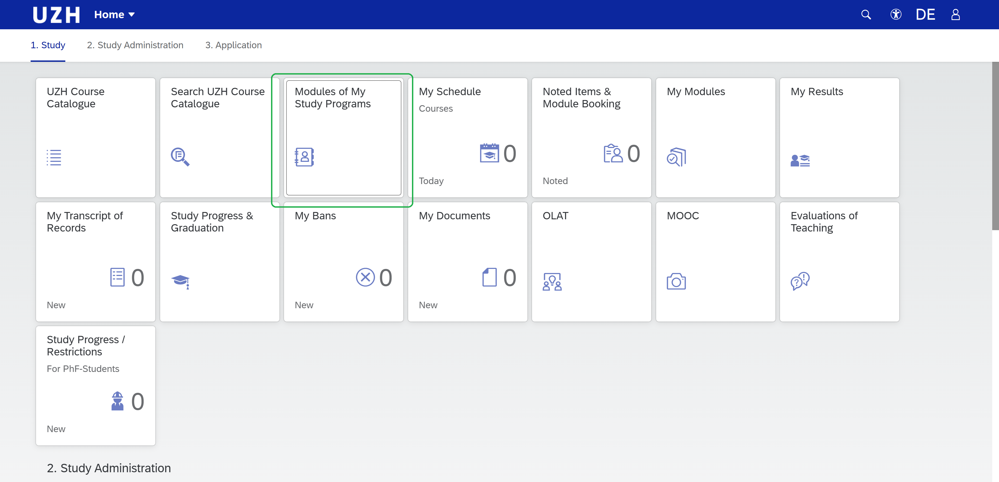
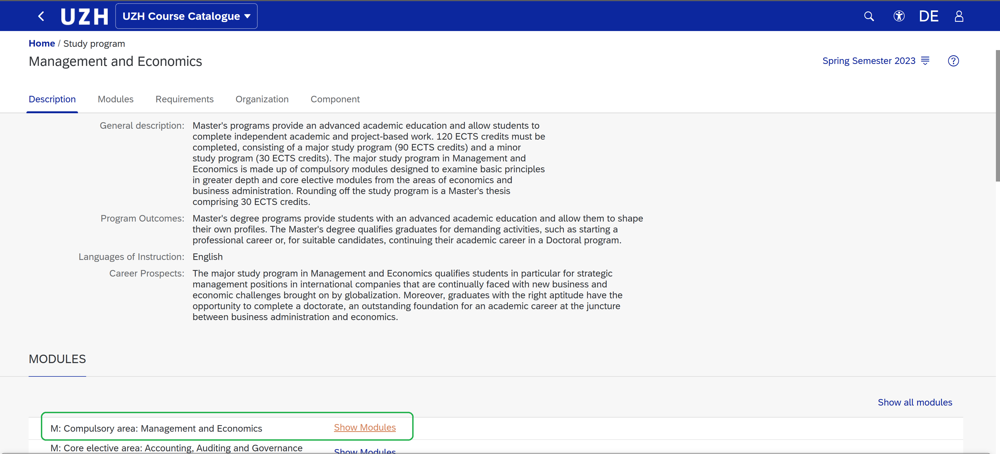
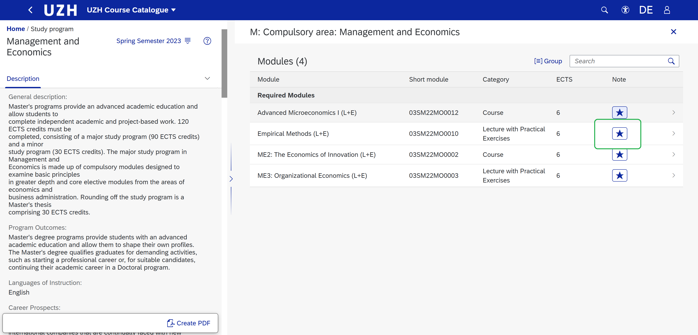
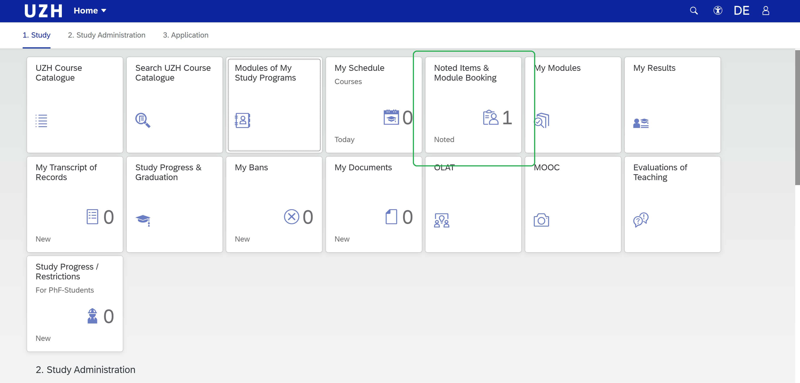
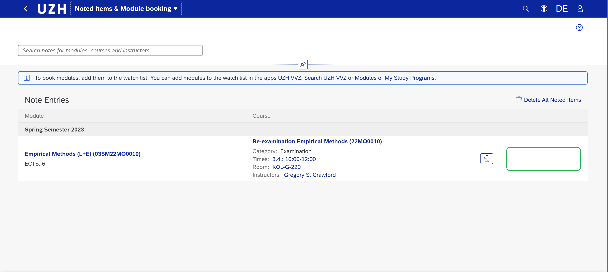
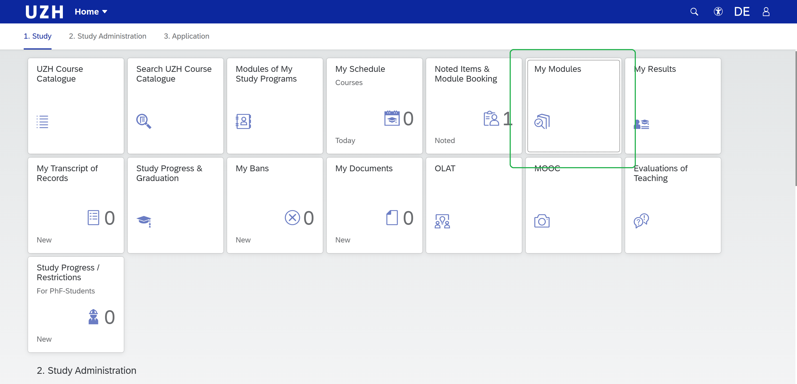
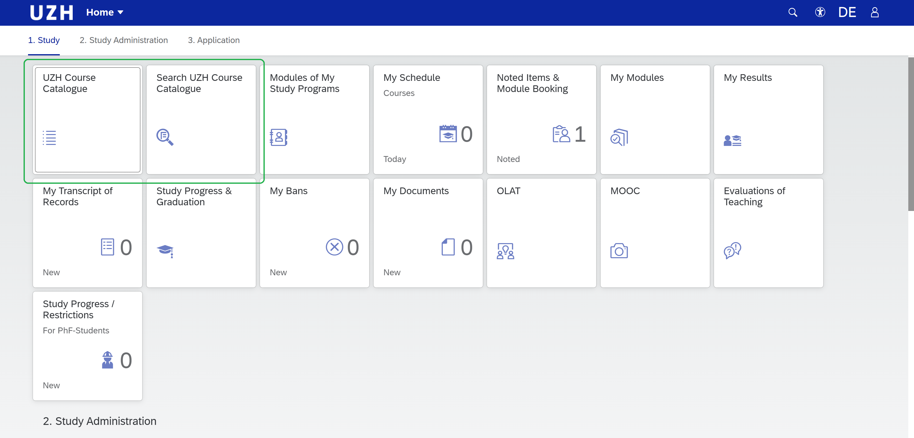

<https://www.uzh.ch/cmsssl/oec/en/studies/admission/matriculation.html>
目前UZH网站处于升级过程问题比较多，各种404，但其实注册流程基本上在录取通知书上面写得一清二楚了

^

**i.缴纳学费**
UZH注册的第一步，完成学费的缴纳之后你才算正式接受了UZH的offer。到达住处安顿下来之后请立刻通过以下链接使用UZH的contact form将你的住址告诉学校
<https://www.uzh.ch/cmsssl/en/studies/dates/adresses/email.html>
临时住址也没大问题，保证邮件收到时你还没有换地方住即可（寄送需要几天时间，一般不会超过一周）。
收到地址后学校会将纸质和电子版的学费账单一起发给你，纸质版需要时间送达，电子版则会直接更新在你的Application Portal上面（这个网址申请天天要用的总不需要我上链接了吧）。然后在UZH Document一栏下就可以找到你的电子学费账单，注意别跟申请费的账单搞混了。注意你看到的界面可能和下图所示略有区别，毕竟我已经完成注册了

建议有了电子账单之后直接使用其缴费，不要等纸质账单。因为不完成学费缴纳你没法获得注册证明，也就没法在Kreisburo进行注册。有了纸质账单也只是方便你少写两个字的事情。
获得账单之后你需要前往邮局缴费，也就是下图这个商标，应该很好找，满大街都是

注意缴纳学费时请携带现金，因为据以往经验，Post缴费无法使用信用卡以及国内的银联卡，而这会你的本地银行卡显然也还没办出来，因此大概率只能使用现金支付。具体数额由你的项目决定，大多数在800-1000CHF之间，具体请参考以下网址以及你申请的项目
<https://www.uzh.ch/cmsssl/en/studies/application/fees.html>

^

**ii.账户信息与注册证明**
学校收到你的学费之后就会向你寄送纸质的注册证明（Voucher）以及学生卡，同时也会于三天之内在系统上更新你的注册状态。届时你将会在UZH Document一栏下看到学校为你发来的包括学校邮箱、用户名以及登陆密码在内的账户信息，使用该账户即可获得UZH学生的大部分服务。

同时请留意实体邮箱中的注册证明，没有它你无法继续进行居留卡的申请流程。
这玩意大致长这样：

来源：
<https://www.uzh.ch/en/studies/application/entry/registration.html#Extension_of_the_Residence_Permit>
注册证明一共四张，理论上你应该会在Kreisburo和移民局各用掉一张。另外由于只有纸质形式，因此只能等学校邮寄。
当然如果你比较着急的话，也可以尝试在没有收到注册证明的情况下直接使用录取通知书去Kreisburo碰碰运气，不少工作人员也会通融一下，帮你完成一些基本的手续，只要你收到注册证明之后回来补交一下就行了。当然这个不一定成功，看具体的工作人员态度。

^

**iii.本科毕业学位证与CDGDC认证**\*
这个主要是面向内地本科毕业的同学的，不一定每个大学都需要，具体请按照自己录取通知书上面的指示进行操作，此处不赘述。就是提醒一下别忘了这步。

^

**iv.学生卡激活**
你需要一张激活的学生卡以享受食堂的优惠价（结账时需要出示有效的学生卡才能享受折扣）以及启用门禁、打印机预充值等功能。学生卡的有效期限会写在卡面上，如果没写的话就是未激活状态。
如果是未激活的话，你需要在校内的激活机器上操作一下（把卡插进去再拔出来）上面应该就会有有效期限了。激活的机器主校区大门进去左手边就有一个，非常显眼。
该操作在你每个新学期缴纳完学费后都需要进行一次。

^

**v.课程注册**
**v.a选课网址及相关时间**
在你完成学费缴纳，收到账户信息之后就可以进行课程注册了，前提是选课系统已经开放，选课系统一般会在第一个Lecture Day之前的三周开放，并在正式开学之后的三周后结束，在此期间你都可以自由地添加或取消绝大部分的课程，具体时间如下
<https://www.uzh.ch/cmsssl/students/en/studyadmin/booking/fristen_hs.html>
你需要登录student portal进行选课操作：
<https://launchpad.uzh.ch/>

^

**v.b选课流程演示**
经过数轮更新之后，UZH的选课界面相比以前已经清楚许多了，不过具体的选课操作可能还是稍微有点绕，以下给大家演示一遍。

^

**注意以下流程对少数几种课程不适用，具体会在后面注明**
首先，如果你只是想按部就班地按着你的项目的要求完成所有必修及选修课的话，请点击”Modules of My Study Programs"：

^

进去之后你可以看到你的主修和辅修专业，无论是主修还是辅修专业的选课操作都是一样的，我们这里以主修为例，点击其中一个专业后进入如下界面。上面的文字描述会很清楚地告诉你要毕业的话需要分别在哪些Area里面各修多少学分，具体根据专业而定。
这里假设我们想先搞定这学期的必修课，点击“Compulsory Area”之后的“Show Modules”进入必修课清单。之后你想接着加选修课的话可以回到这个界面点击其他的Area，这个界面下显示的保证都是能算进你专业毕业所需学分的选修课

^

点击“Show Modules”后就可以看到该Area下这学期开放的课程列表，你可以点击课程名称查看该课程的细节，比如上课和考试时间、课程内容、教授信息、课程前置知识要求等等。觉得自己这学期想上这门课的话就点击右边的五角星按钮标记该课程，相当于把这门课塞进了你的购物车。
这里我们假设我们要上Empirical Methods这门必修课

^

重复上述操作直到你觉得这学期的课已经够多了（30学分左右一般是一个比较理想的状态，当然少选或者多选几分也没什么问题，系统对此并没有限制）。这个时候就该去清空你的选课购物车了，前往“Noted Items & Module Booking”界面。

^

这里你可以看到之前自己加了标记（加入购物车）的所有课程，在决定要上的课程后面点击Booking Module之后就算选课成功了，这张图片里面由于此时选课系统尚未开放，因此没有这个按钮。

^

最终你注册成功的课程都会在“My Modules”里面显示，如果你之后改变注意想要取消课程的话，也是在这个部分里面操作（很简单，点个取消就行，这里不赘述）注意选课系统开放的Deadline即可

^

如果你想拓展一下自己的知识面，或者将来有转专业的计划，想要学习一些专业之外的课程的话。你需要进入Course Catalogue或者Search界面，前者用于在你没有明确目标时浏览各个专业的课程时使用，后者用于你在知道某节课的具体名称后进行具体的检索。这两个界面内的课程都没有经过筛选，你可以看到包括你的专业课在内的一切可选课程。找到课程之后操作和上面一样，也是点五角星加入购物车然后Book，这里不重复了。

^

**注意：Seminar**
大部分的UZH课程都没有Quota，也就是说基本不存在抢课抢不到的情况。但有一种课程例外，那就是Seminar。无论你是哪个专业都需要修够一定学分（选修范围内9或12分，根据专业而定）的Seminar之后才能毕业。
Seminar算是UZH学生最头大的一种课程，其一般为小班式的讨论课，内容以案例分析和实际操作为主，它的特殊之处在于极其严格的人数限制，大多数Seminar只有15\~25人左右的限额，搜索和注册Seminar的流程和上述其他课程一样，但注册完成Seminar并不意味着你获取了Seminar的名额。
在Seminar的课程描述界面，你往往可以看见教授对申请这门Seminar的同学所布置的一些任务，内容可能包括但不限于：提交成绩单和已学课程列表，撰写动机信，上传简历，就某个话题准备一篇小论文等等。只有在完成这些任务，并得到来自教授的邮件确认之后，才算正式获准加入这个Seminar。
如果教授没有同意你的申请，请及时在My Modules界面里把这门课cancel掉，否则在学期结束之后你会自动挂掉这门课。
另外值得一提的一点是Seminar的申请主要由教授个人决定，不受系统限制，因此其申请时间段一般远早于正式的选课阶段，有很多热门的Seminar甚至在选课阶段还没开始的时候就已经满人了。因此想要保证选择的数量的话，最好在选课阶段开始前一个月乃至两个月之前就开始准备Seminar的申请（Seminar课程信息界面一般都会注明申请的时间段，每个Seminar各不相同）。换句话说如果你是9月份刚入学的新生的话，等你完成注册时第一个学期的Seminar注定已经有好多申请不了了。这个没什么办法，只能在后续学期尽早尽快申请，不过好在大多数专业也就要求9分的Seminar，也就是两到三门课的水平，两年时间里拿到这两三门课的名额也不算什么难事。

^

**v.c选课注意事项**
1.如果不想上某节课了一定要记得把它取消掉，否则这门课期末会自动挂科。就算你只是想去旁听一下也要取消，UZH大部分课堂并不会管来上课的是不是注册了这门课的学生。
2.和ETH不同，UZH的期末考试并不需要额外注册，你注册了课程的同时也会自动帮你注册期末考试（如果有的话）。因此请在选课时注意所选课程的期末考试时间是否有冲突。如果课程时间冲突的话还可以通过看录播/自学等方法弥补；考试时间冲突的话就没办法解决了，除非你会分身术。
3.如果你不会德语，选择选修课时务必注意课程的教学语言，部分选修课会以纯德语形式教学。
4.在2022年的制度更新之后，同一门专业必修课你只有两次尝试的机会，第一次挂了之后的补考也算一次。也就是说如果你挂了一门必修课，然后补考又挂了的话，那就只有退学和转专业两条路了。因此请认真对待必修课，必要时少选其他课程以优先保证必修课尽早完成。不过也不用因此过于紧张，大部分专业必修课通过率都比较高，只要不是整个学期都在梦游，最起码的通过还是不难的。
5.德语课以及其他语言课程的申请系统是独立于常规课程的，具体请参考以下网址
<https://www.uzh.ch/cmsssl/sprachenzentrum/en/Sprachkurse.html>
顺便提一嘴，德语课也是名额限制的，而且非常不好抢，基本开放出来没过多久就没了。
6.关于哪些课比较好值得选，这个比较尴尬，因为前几年还有个叫Bestande的APP上面会有详细的各课程往年通过率和学生对课程的细心评价（以及各种对教授和助教的亲切问候）。然而该软件2022年下旬开始由于开发者个人原因停止维护，已经不再更新了。因此课程评价这块基本处于空白状态，大家想了解相关信息的话也只能去各种论坛上摸索了。
当然，如果有哪位高手能搞出个Bestande v2.0的话，我相信全UZH的普罗大众都会感谢你的。
