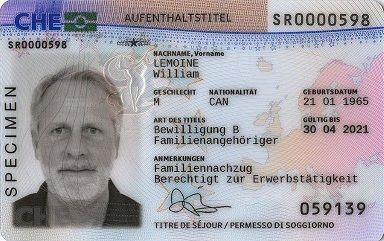
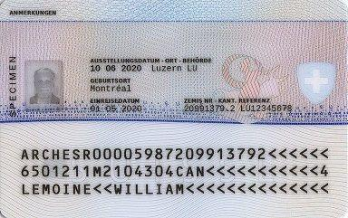

> [success] 本章作者：张堃、陈雨航、赵逸飞

> [warning] *本章节仅介绍新迁入人员首次办理居留证的流程，关于居留证的临期换发和遗失补发请参考[生活篇《证照相关》章](<34证照相关.md>)*。

### **1. 办理时间&地点**
在人口登记处完成首次住址申报后，需要按**预约时间**（参见[本篇《办理“迁入”》章](<办理“迁入”（首次住址申报）.md>)）前往**苏黎世州移民局**（地址：[Berninastrasse 45, 8090 Zürich](https://goo.gl/maps/CDzxUoomjsara83c7)）办理居留证（DE: Aufenthaltsbewilligung; EN: Residence Permit），此后才算正式成为苏黎世的居民。

^
### **2. 需携带材料**
***（如本部分内容与预约单上要求有出入的，以后者为准）***
- 办理住址申报时获得的预约单
- 护照
- 申报确认函（Meldebestätigung，参见[本篇《办理“迁入”》章](<办理“迁入”（首次住址申报）.md>)）

^
### **3. 办理流程**
首次办理居留证时，需要进行指纹录入并拍摄照片（作为证件上的头像照片使用），全程按工作人员指导完成即可。
在办理完成一段时间后（视申请人数以及移民局员工的工作效率，时间从几周到一两个月都有可能），居留证将以挂号信形式寄出。
> [warning] 【学联提醒】须确保邮箱上标记有**本人姓名**才能收到信件！

^
### **4. 居留证介绍**
一般，在瑞留学生（包含本科、硕士、博士）获得的居留证是**B类**，有效期为1年（临期换发请参见[生活篇《证照相关》章](<34证照相关.md>)），其样证见下：

其中，居留证背面包含有“ZEMIS Nr.”和“Kant. Referenz”，这两个号码在办理诸多业务时（例如通过Kontakt Formular或电话联系移民局时，见后文）都需要提供。

^
### **5. 联系移民局/补交材料**

有时，移民局可能会向申请人致信要求补交材料。在移民局未强调需要原件的情况下，此项可通过移民局的联系表格进行，见下。如移民局强调需要原件，申请人则需要将相关文件通过邮寄方式递交，邮寄地址见前文。

* **移民局网上联系表格**：
  链接：[Kontaktformular Migrationsamt](https://www.zh.ch/de/migration-integration/kontaktformularmigrationsamt.html)
  该联系表格还可用于问题咨询等。通过该表格联系移民局，尤其是通过此方式提交材料审批的，移民局都会等审批完成后再回复，其耗时可能较长，因此必要时可拨打电话咨询审批进度，见下。
* **移民局咨询电话**：+41 43 259 88 00（瑞士时间星期一到星期五 08:00-12:00、13:00-16:30可用）
  *拨打该电话，有很大概率会提示“所有雇员正忙，请稍后”，此时可耐心等待；如等待较长时间仍未接听的，可尝试挂断并再次拨打，并在再次拨打时切换服务语言（例如先前选择英语，第二次则可选择德语；无需担心语言不通问题，德语和英语岗位上的客服人员都熟练掌握这两种语言）。如仍然无效的，建议等到其下次开始上班时间再次拨打*。

^
