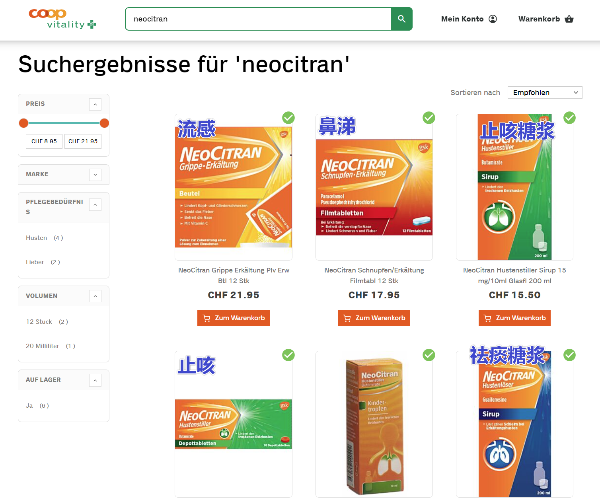

> [success] 本章作者：徐思婕、陈小雨、陈雨航

> [warning] 本章节内容需要更好地融合

> [info] 【学联提醒】
>
> * 普通伤病可在瑞各城市火车站医护中心治疗。危重病患需赴大医院救治。也可拨打医疗急救电话 144，或空中（雪山）救援电话1414，请求帮助。
> * 如果病情或伤势较重，需要国内亲友来瑞陪伴，请联系中国使（领）馆，出示医院开具的医疗证明，以便使（领）馆通知您国内亲友，并协助办理相关手续。

### **1. 就医**

详细信息可参考UZH制作的就医指南：:attachment[220502\_Health\_Issues\_information.pdf]{src=".topwrite/assets/220502_Health_Issues_information.pdf" size="286.64 kB"}

#### **1.1 医院**

**Universitätsspital Zürich (University Hospital of Zürich**)

**地址**：Rämistrasse 100, 8091 Zürich （就在ETH主校对面）此外还有很多分院区。

**挂号方式**：

**在线挂号**：可以在苏黎世大学医院的网站(<https://www.usz.ch>)上进行在线挂号，需要提供个人信息和就诊需求，然后选择一个合适的时间进行预约。

**电话挂号**：可以通过拨打苏黎世大学医院的预约电话进行挂号。预约电话号码是：+41 44 255 11 11。需提供您的个人信息和就诊需求，然后选择一个合适时间进行预约。

**现场挂号**：如果需要立即就诊或在线预约不方便，也可以前往苏黎世大学医院的前台或医院门诊部门进行现场挂号。需携带健康保险证件和个人身份证明。

^

就诊时务必提前准备好个人信息、健康保险证件、个人身份证明和就诊需求。

该医院涵盖了内科、外科、妇产科、神经科、心脏科、肿瘤科等在内的多个科室。但通常看病不太去医院，更多是去诊所或者家庭医生。

^

**其他公立医院**：

Triemli Hospital--<https://www.stadt-zuerich.ch/triemli/en/index.html>

Waid Hospital--<https://www.stadt-zuerich.ch/waid.html>

University Children’s Hospital--<https://www.kispi.uzh.ch>

University Eye Clinic--<http://www.augenklinik.usz.ch>

^

#### **1.2 普通诊所**

1. 预约：Onedoc 网站即可预约<https://www.onedoc.ch/en/>。有线上、线下两种看病方式。
2. 需选择医生类别，以及就诊地点。 常见医生类别：General Practitioner(GP) 全科医生，Ophthalmologist 眼科医生，Dermatologist 皮肤科医生，Denlist 牙医等。如果不知道选，可选全科医生。
3. 选择2中内容后，就会展示各个医生可行时间，按步骤进行预约，填写相关信息即可。
4. &#x20;就医前提前准备好个人信息、健康保险证件、个人身份证明和就诊需求。如果有些病情不太会描述，提前翻译好，方便沟通。
5. &#x20;若就诊时，保险卡还没有办下来，但已经在保险公司购买了相关保险。可以自己先垫付，让诊所工作人员给你费用单，之后交给保险公司即可。

^

**可以直接walk in无需预约的诊所（紧急状况**）

Permanence Hauptbahnhof&#x20;

地址：Bahnhofplatz 15, 8021 Zurich。营业时间：7:00-22:00

Permanence Marktplatz Oerlikon

地址：Querstrasse 15, 8050 Zürich。营业时间：Mon–Sat 7am–8pm / Sun 10am –5pm

^

#### **1.3 线上预约/就诊**

Swisscare客户可在Swisscare App上可以查看到本地各家医院和诊所以及医生的信息并预约。

Groupe Mutuel客户可使用Medgate APP，填写相关信息线上就诊，也可以拨打电话就诊[0900 11 44 11](<tel:0900 11 44 11>)。

就诊前先准备好个人信息、健康保险证件、个人身份证明和就诊需求。

> 注：这边就医具体报销情况，需要根据自己所购买的保险决定。

#### **1.4 牙医**

苏黎世牙科价格非常昂贵，补牙约300瑞/颗，洗牙200瑞左右。

建议在出国前完成拔智齿/洗牙/补牙所有操作。

如遇突发情况，可选择去德国边境城市康士坦兹就医，价格约为瑞士2/3。

布达佩斯也是很好的选择，享有先进的牙科技术与经济实用的价格，还能顺便旅游观光。其拥有完整的牙医产业链，有的诊所提供免费接机与住宿服务，补牙价格约50瑞/颗。如果时间充裕，可以匈牙利-奥地利-捷克三国游，感受东欧的建筑与人文。

土耳其同理，物价洼地，顺带旅行。但需办理电子签证，60美刀，秒下签，180天有效期。

无论在哪个国家，面诊之前最好打电话预约，避免出现白跑的情况。

以上价格均为个人经验预估，具体牙齿和诊所的收费标准不一，仅作参考。

### **2. 买药**

街上店铺带有绿色“十”字，并写有“Apotheke"的都是药店。药店买药大多需要医生的处方，没有处方的话很多药都不能买，即使能买也不能报销。如果有了医生的处方，带着处方和保险卡就可以买药。这边大部分常见药品都是可以报销的，具体需要看所购买的保险种类。

> 注：这边医生开的处方是有“保质期”的，比如说2023/04/01-2023/07/01，意味着只能在这个时间段内购买该处方上的药。因为很多药物都需要报销，药店是要把处方寄给保险公司的，所以如果你需要在“保质期“内反复购药，一定要记得让工作人员帮你复印一份处方。

#### **2.1 药店**

**苏黎世24小时药店**：

Bellevue Apotheke。地址：Theaterstrasse 14, 8001 Zürich

^

**苏黎世365天开门的非24小时药店**：

Amavita Bahnhof Apotheke, Wannerhalle, Museumstrasse 1, 8001 Zürich

Bahnhofapotheke Oerlikon, Bahnhof Oerlikon, Hofwiesenstrasse 369, 8050 Zürich

^

#### **2.2 常见非处方药**

^

### **3. 急诊**

ETH主校对面的Universitätsspital Zürich (University Hospital of Zürich) 就可以急诊。急诊入口不在大门处，需要从边上绕过去。就诊时务必提前准备好个人信息、健康保险证件、个人身份证明和就诊需求。

如果没有特别紧急的情况，建议少去急诊，这边急诊比较慢。除昏迷、失去意识、大出血等情况，一般需等候3-4小时。或者可以去permanence。

^

### **4. 疫苗**

UZH在Central的诊所可以预约打疫苗，如TBE（蜱虫疫苗），FLU，HPV。

1. 预约链接：<https://reisemedizin.uzh.ch/en/book_appointment>
2. 地址：Hirschengraben 84, 8001 Zürich
3. 流程：网上预约-->第一次去只需带护照和保险卡，后面需要带护照、保险卡和疫苗小本本（医生会给你的）--> 按时赴约，签到，医生会给你号码牌-->叫到号后，打针，医生会问你一些个人身体状况的问题，需如实回答-->打完针后，有些疫苗需要先付款，然后把费用单给保险公司再报销，有些可以直接报销。

> 注：具体疫苗报销情况，需要根据自己所购买的保险决定。

^
