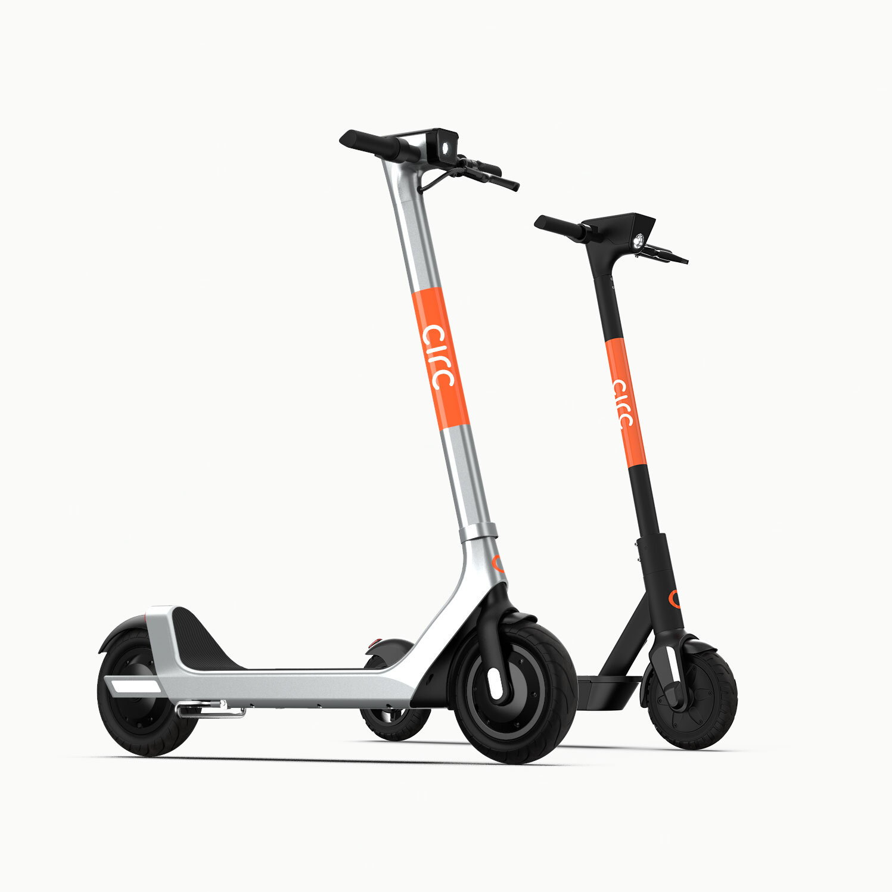

> [success] 本章作者：赵逸飞

> [warning]【学联提醒】*苏黎世市区地形崎岖，（尤其是学校附近）有大量斜坡地形。强烈建议大家实地体验后再决定是否使用自行车作为主要出行方式。如希望体验骑行乐趣但又不想过于疲惫的，可选择使用电助力自行车（e-Bike）。*

### **1. [PubliBike](<https://www.publibike.ch/en/home>)共享单车服务**

*图片来源：[NZZ - Publibike lanciert einen heissen Zürcher Mietvelo-Sommer](<https://www.nzz.ch/zuerich/publibike-lanciert-den-heissen-zuercher-mietvelo-sommer-ld.1374926?reduced=true>)*

- 简介：苏黎世地区规模最大的共享单车服务商，在苏黎世和部分其他瑞士城市都被广泛使用。
- 车辆：提供普通自行车和电助力自行车（e-Bike）
- 手机app：[PubliBike app](<https://www.publibike.ch/en/publibike-app>)
- 取/还车：须**定点取/还车**，可使用手机app查看附近站点及其车辆情况；取车时可使用手机app或者SwissPass实体卡解锁；具体操作可参考[PubliBike - How it works](<https://www.publibike.ch/en/how-it-works>)
- 价格：请参考[Publibike - Pricing](<https://www.publibike.ch/en/subscriptions>)（其中，“B-Quick”为基础/默认套餐）
- 学生优惠：
➢ ETH学生优惠：[ETH - Züri Velo by PubliBike](<https://ethz.ch/students/en/campus/transport-mobility/velo/publibike.html>)
➢ UZH学生优惠：~~[PubliBike Sommeraktion an der UZH](<https://www.ib.uzh.ch/de/newsDIB/PubliBike-UZH.html>)~~（至2023年9月30日有效）
- 其他信息：请参考[Publibike - FAQ](<https://www.publibike.ch/en/faq>)

^
### **2. [ETH Urban Connect](<https://ethz.ch/students/en/campus/transport-mobility/velo/urban-connect.html>)共享单车服务**

*图片来源：[Urban Connect](<https://www.urban-connect.ch/eth>)*
- 简介：ETH联合Urban Connect为其教职工和学生提供的共享单车服务
- 车辆：提供电助力自行车（e-Bike）
- 手机app：Urban Connect
- 价格：
- 取/还车：须**定点取/还车**，在主校区、洪堡校区和Oerlikon校区设有站点
> [info] 【学联提醒】*还车时可能会遇到技术BUG，此时需在app内部联系客服。*
- 其他信息：请参考[ETH - Urban Connect Bikesharing](<https://ethz.ch/students/en/campus/transport-mobility/velo/urban-connect.html>)、[Urban Connect - ETH](<https://www.urban-connect.ch/eth>)

^
### **3. 共享电动滑板车（e-Scooter）服务**
苏黎世有数家不同企业提供共享电动滑板车（e-Scooter）服务，其使用方法和操作流程均与国内共享单车类似（具体请参考企业官网/app，见下），**无须定点取/还车**。苏黎世主要的共享电动滑板车包含：
- [LIME](<https://www.li.me/en-ch/>)（亦提供少量共享单车，但规模较小，暂不列入前文）

*图片来源：[LIME](<https://www.li.me/en-ch/>)*
- [BIRD](<https://www.bird.co/>)

*图片来源：[In Your Pocket](<https://www.inyourpocket.com/zurich/getting-around/electric-scooters>)*
- [TIER](<https://www.tier.app/en/>)

*图片来源：[In Your Pocket](<https://www.inyourpocket.com/zurich/getting-around/electric-scooters>)*
- [CIRC](<https://www.circ.com/>)

*图片来源：[CIRC](<https://www.circ.com/>)*