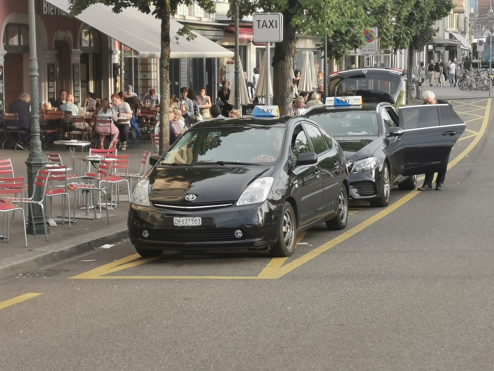
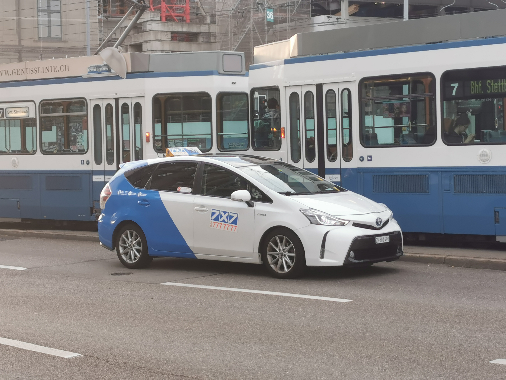
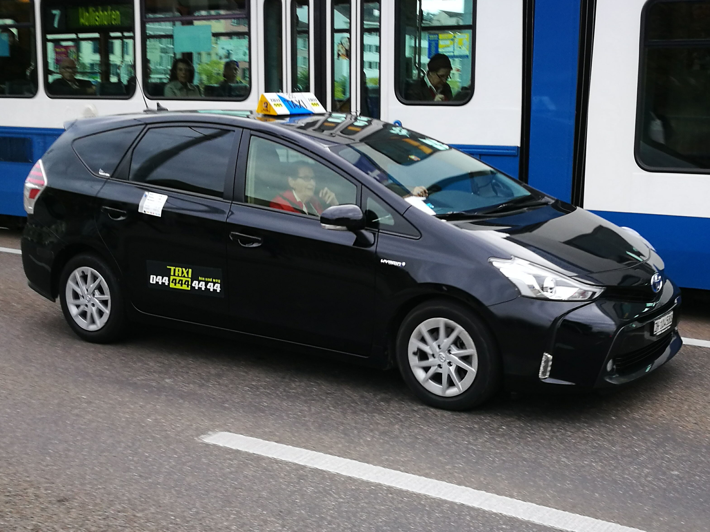
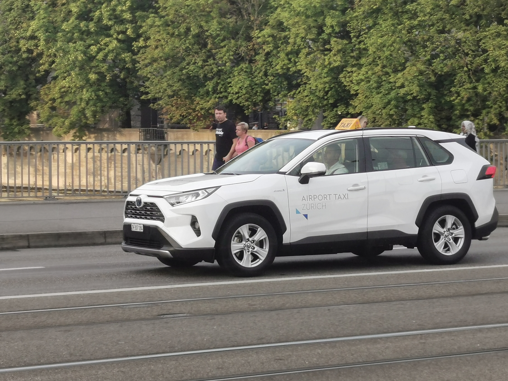

> [success] 本章作者：赵逸飞

### **1. 搭乘出租车出行**
苏黎世的出租车分为“公司出租车”和“个体出租车”，一般前者价格相对低廉。其车型一般包含轿车、旅行车、SUV、MPV的等，乘客可按需选择。
一般，在苏黎世打车主要采取电召（使用叫车电话或手机app，具体见各出租车公司官网）形式；始发地为机场、火车站、市中心等交通枢纽的，也可以在其出租车站（如下图）直接上车。

苏黎世的正规出租车有着统一的顶灯样式（见本节配图），同时在后窗或后门处张贴有该车的定价。除手机app叫车时会采取“一口价”模式（由软件计算）外，一般都会使用计价器。
苏黎世主要的出租车公司包含：
- [7×7公司](<https://www.7x7.ch/en/chauffeur-services/taxis/>)
价格：待添加
叫车电话：+41 44 777 7777
叫车app：7×7 app（即将发布）

- [7×4公司](<https://www.taxi444.ch/>)
价格：待添加
叫车电话：+41 44 444 4444
叫车app：“Taxi 444 AG, Zürich” app

- [机场出租公司（Airport Taxi Zürich）](<https://www.airporttaxi-zuerich.ch/en>)（只承运往返苏黎世机场乘客）
价格：**起步价7瑞郎，每公里4.20瑞郎，每分钟1.31瑞郎**
叫车app：Airport Taxi Zürich app

- 个体出租车
价格：一般为**起步价8瑞郎，每公里5瑞郎，每分钟1.33瑞郎**，少数个体出租车可能价格更低

^
### **2. 搭乘网约车出行**
在苏黎世，除搭乘出租车外还可搭乘Uber平台的网约车，使用方法与国内网约车类似，一般价格比出租车稍低，具体请参考其官网或手机app。