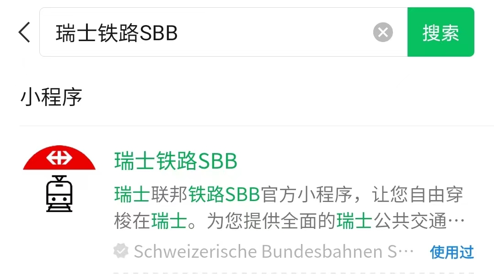
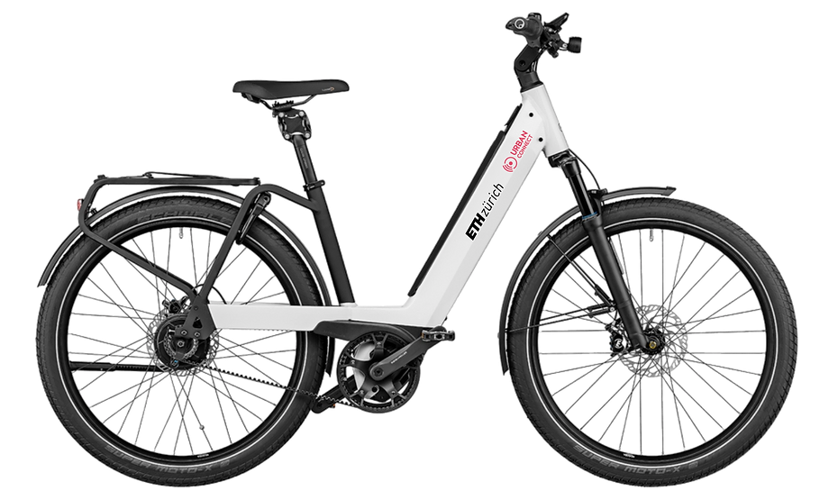
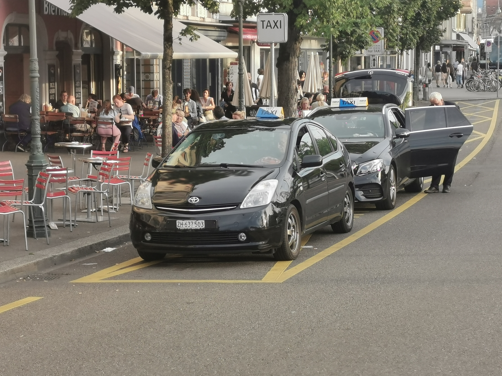
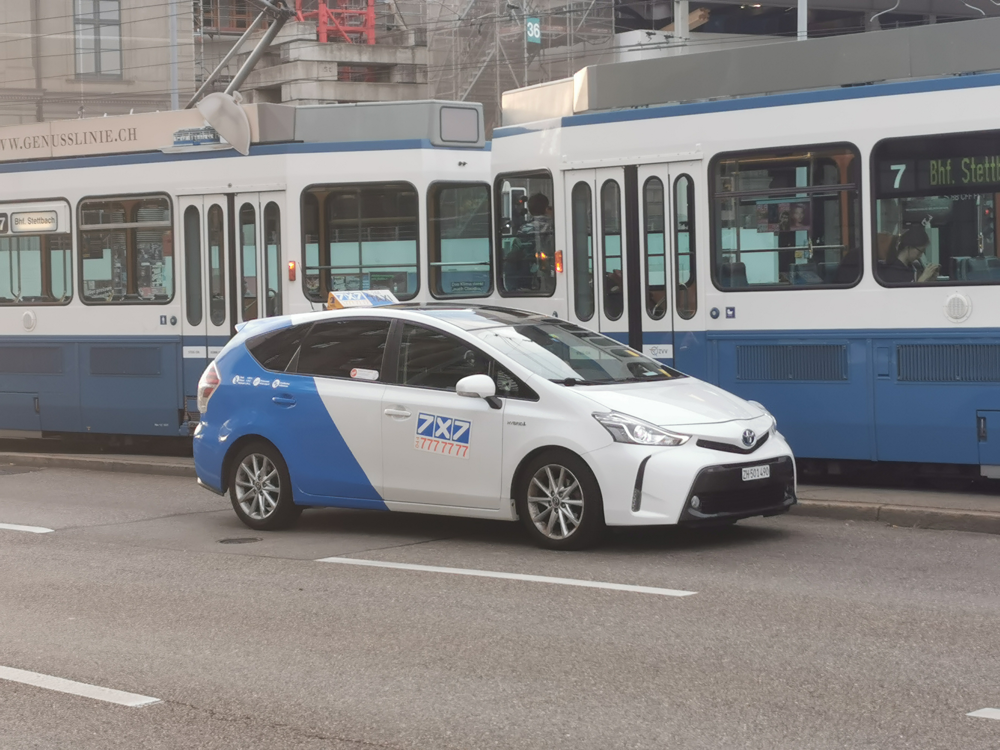
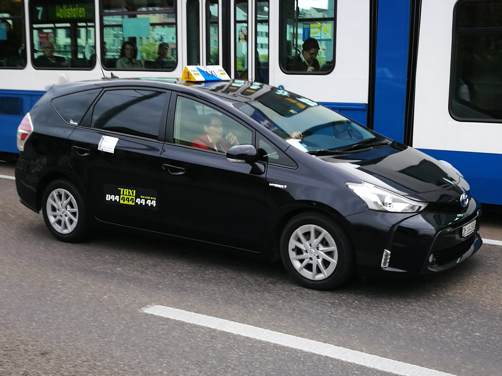

> [success] 本章作者：杨晨宇、赵逸飞

> [warning] 【学联提醒】本章节关于公共交通优惠套餐的推荐介绍仅供参考，请结合自身实际需求权衡选择！

### **1. 概述**
在苏黎世，得益于发达的公共交通系统，大多数同学选择搭乘公共交通上下学及进行其他必要通勤（如办事、购物等），也有少量同学选择骑乘自行车/电动滑板车（e-scooter）等，而驾驶汽车进行日常通勤对绝大部分同学的需求和环境而言并不方便。

> [info] 【学联提醒】鉴于各类通勤方式的优劣势与所住地区、日常通勤频率、路线等都紧密相关，建议在抵达苏黎世后再根据个人实际体验和需求选择适合自己的交通方案。

^
### **2. 搭乘公共交通出行**
#### **2.1 苏黎世公共交通系统简介**
苏黎世的公共交通系统主要由市郊铁路（S-Bahn）、有轨电车（Tram）和公共汽车（Bus）组成，线路图可参考[ZVV - Network Maps](<https://www.zvv.ch/zvv/en/timetable/network-maps.html>)。
作为常驻苏黎世的留学生，使用公共交通系统进行的日常出行与以下名词是密不可分的：
* [苏黎世公共交通运输委员会 \[Zürcher Verkehrsverbund (ZVV)\] ](https://www.zvv.ch/zvv/en/home.html)，
由苏黎世区域所有公共交通服务提供者组成的委员会，整合铁路、有轨电车、公共汽车、轮船等所有公共交通资源。更多信息可参考：[Fun facts about ZVV](https://secrets.zvv.ch/)
* [瑞士联邦铁路集团 \[Schweizerische Bundesbahnen (SBB)\]](https://www.sbb.ch/en)
负责苏黎世绝大多数市郊铁路（以及瑞士境内和跨境长途铁路）的管理运营，其在苏黎世管内线路受ZVV管辖。
* [瑞士公共交通“一卡通” (SwissPass)](https://www.swisspass.ch/info/welcome)
一张实名制的卡证，持卡者所购买的[区域月票/年票等套餐](https://www.zvv.ch/zvv/en/travelcards-and-tickets/travelcards/networkpass.html)（详见下文）都可以绑定在这张卡上供检票员识别。

此外，ETH还为其学生提供免费的主校区⇄洪堡校区摆渡车（eLink）服务，具体可参考：[ETH - eLink](<https://ethz.ch/students/en/campus/transport-mobility/science-city-link.html>)

#### **2.2 相关手机app**

SBB和ZVV都有自己的手机app：
* [SBB Mobile app](https://www.sbb.ch/de/fahrplan/mobile-fahrplaene/sbb-mobile.html)
* [ZVV app](https://www.zvv.ch/zvv/de/service/apps/zvv-app.html)

二者均可进行查询路线/车次、购票、绑定SwissPass等操作，使用起来并无显著差别。

此外，SBB还提供微信小程序服务，在微信搜索栏中搜索“瑞士铁路SBB”即可，其支持查询路线/车次，购票等操作，但不支持绑定SwissPass。此外，在此购票将直接使用微信付款，即按实时汇率扣除微信零钱或绑定银行卡中的对应数额的人民币。鉴于当前汇率较高，仅推荐临时应急使用。

#### **2.3 优惠套餐选择**
> [info] 【学联提醒】
> - 无论选购何种套餐，其都会记录在SwissPass卡片的芯片中，出行时携带该卡片并在乘务员检票时向其出示即可。亦可选择将SwissPass卡片绑定到SBB的app中，此时在乘务员检票时只需向其出示app中绑定的SwissPass即可。
> - 如初到苏黎世还未找到稳定住所的，或后期会搬家但尚不知道新住址的，或想要体验公共交通通勤并将其与其他通勤方式对比权衡后再行决定主要采用何种通勤方式的，可先购买短期（如1-2个月）的月票，待情况稳定/权衡完毕后再根据个人实际需要进行选择。

##### **2.3.1 苏黎世内通勤优惠套餐：区域月票/年票**
ZVV将苏黎世地区划分成许多“交通分区”（详见[苏黎世地区交通分区地图](https://www.zvv.ch/zvv/en/travelcards-and-tickets/zones/zone-maps.html)），其中：
- 110区对应苏黎世市区，**ETH/UZH的所有校区、苏黎世主火车站和市中心均在该区**
- **苏黎世机场位于121区**
- 各车站所属交通分区查询平台：[ZVV - Regionalnetz](<https://www.zvv.ch/zvv/de/fahrplan/liniennetz/regionalnetz.tab-tab.html>)

同时，ZVV采取分区计价的原则（110区和121区均须双倍计算），**购买涵盖某区的月票/年票代表可在有效期内免费搭乘该区内所有公共交通。** 因此，请根据自身实际需要，选购[能够包含自己日常活动所涉及区域的月票或年票](https://www.zvv.ch/zvv/en/travelcards-and-tickets/travelcards/networkpass.html)。例如：
- 大多情况下**只在110区生活及学习**，则只需选购110区（双倍计算后为2个区）的月票/年票
- 住址在120区（对应Winterthur），但需要在110区（市区）上课，路途会经过121区和122区，则需要购买覆盖110区、121区、122区、120区（110区和121区双倍计算后为6个区）的年票/月票

此外，如购买区域月票/年票后需要在其有效地理范围以外出行的（例如因日常活动范围主要在110区而购买110区年票，但需要临时前往121区办事），需要购买临时加区票，具体可参考[ZVV - Zone upgrade](<https://www.zvv.ch/zvv/en/travelcards-and-tickets/tickets/zone-upgrade.html>)。

关于SBB提供的其他优惠套餐请参考：[SBB - Travelcards](<https://www.sbb.ch/en/travelcards-and-tickets/railpasses.html>)
关于ZVV提供的其他优惠套餐请参考：[ZVV - Travelcards](<https://www.zvv.ch/zvv/en/travelcards-and-tickets/travelcards.html>)、[ZVV - Tickets](<https://www.zvv.ch/zvv/en/travelcards-and-tickets/tickets.html>)

##### **2.3.2 长途旅行优惠套餐**

对于前往其它城市的长途旅行需求，则需要通过SBB的app/小程序/网站购买车票。如经常出行的，推荐以下优惠套餐：

* [半价套餐 Half Fare Travelcard](https://www.sbb.ch/en/travelcards-and-tickets/railpasses/half-fare-travelcard.html)：价格依具体套餐选择有所不同；所有客票半价
* [夜间旅行套餐 Night GA Travelcard](<https://www.sbb.ch/en/travelcards-and-tickets/railpasses/ga/night-ga-travelcard.html>)：每年99瑞郎，仅适用于不满25岁人员；每晚19:00至次日凌晨05:00可免费乘车

关于SBB提供的其他优惠套餐请参考：[SBB - Travelcards](<https://www.sbb.ch/en/travelcards-and-tickets/railpasses.html>)

#### **2.4 初次抵达苏黎世后**

对于首次前来苏黎世留学的同学，在飞机落地苏黎世，通过边检并拿到行李后，首先需要考虑从机场到住址的行程，该段行程一般选择公共交通。
苏黎世机场设有SBB营业柜台，因此如入境时间较早，可直接在机场购买[区域月票或年票](https://www.zvv.ch/zvv/en/travelcards-and-tickets/travelcards/networkpass.html)，详见下节。
> [warning]【学联提醒】因机场位于121区，如在机场办理110区的月票/年票的，还需要额外购买一张121区的临时加区票（参见前文或[ZVV - Zone Upgrade](<https://www.zvv.ch/zvv/en/travelcards-and-tickets/tickets/zone-upgrade.html>)）才能搭乘公共交通前往110区。

若入境时间较晚，SBB营业柜台已下班的，那么需要通过
- SBB或ZVV的app（见前文；银行卡支付）或
- 自动售票机（银行卡支付）或
- “瑞士铁路SBB”微信小程序（微信支付）

购买前往住所的单程票，具体路线（目的地附近站点、乘车路线、中转地点等）可参考SBB/ZVV和/或谷歌地图导航等。
如抵达苏黎世后需要接机服务的，请参考[学联《接机供求贴》](<https://forum.acssz.org/d/950-2023qiu-ji-xin-sheng-jie-ji-gong-qiu-fa-bu-tie/19>)；如希望乘坐出租车或网约车前往住所的，请参考本章第四节。

#### **2.5. 优惠套餐和SwissPass的办理和使用**

##### **2.5.1 办理优惠套餐和SwissPass**

首次购买[区域月票或年票](https://www.zvv.ch/zvv/en/travelcards-and-tickets/travelcards/networkpass.html)等优惠套餐（具体见前文）时，会一并获得配套的SwissPass（用来绑定所购买的优惠套餐）。该两项业务一般既可在SBB的线下网点办理，也可以线上办理。
**线下办理**的主要网点包含：
- 苏黎世主火车站（Zürich HB）网点：[SBB Counter](https://goo.gl/maps/JTy8Kee2fbZ5SigC9)
- 苏黎世机场网点：[SBB Reisezentrum](https://goo.gl/maps/v1efYctGYJcWsb3P9)
- 苏黎世Oerlikon火车站网点

关于瑞士境内其他SBB网点请参考：[SBB - Points of sale](https://www.sbb.ch/en/station-services/at-the-station/services-at-the-station/gift-ideas/mondaine/points-of-sale.html)

线下办理时，须携带**护照**和**一张护照规格照片**，还需向工作人员提供**居住地址或c/o地址**用于邮寄实体SwissPass卡；办理SwissPass不收取额外费用，仅须缴纳所购买的优惠套餐费用即可。线下办理完成后，可得到一张纸质的临时SwissPass证明，该证明须在搭乘公共交通时随身携带，避免丢失，以供乘务员查验。

**线上办理**请参考[SBB - buy travelcards and tickets](<https://www.sbb.ch/en/travelcards-and-tickets/buying-options/buy-travelcards-and-tickets.html>)。办理必须由本人进行，需要提前准备好护照和一张电子版的护照规格照片，且需要通过手机进行身份认证。

如不购买任何优惠套餐，只希望办理SwissPass实体卡用于其他服务（如解锁共享单车，见后文）的，则应在SBB的线下网点办理，具体参见前文。

无论选择何种办理方式，一般办理后约十天即可在信箱中收到邮寄的SwissPass实体卡。

##### **2.5.2 SwissPass的使用和绑定**
无论选购何种套餐（见前文），其都会记录在SwissPass卡片的芯片中，出行时携带该卡片并在乘务员检票时向其出示即可。
亦可选择**将SwissPass卡片绑定到SBB和/或ZVV的app中**：SwissPass卡号可以用来注册和绑定其对应的[SwissPass账户](https://www.swisspass.ch/register)，使用该账户即可将SwissPass绑定到[SBB](<https://www.sbb.ch/de/fahrplan/mobile-fahrplaene/sbb-mobile.html>)和/或[ZVV](<https://www.zvv.ch/zvv/de/service/apps/zvv-app.html>)的app中，之后在检票时即可直接向乘务员出示手机app中的SwissPass，较实体卡更为方便。

关于SwissPass的更多信息和介绍，请参考：[SBB - Help with your SwissPass](https://www.sbb.ch/en/help-and-contact/produkte-services/swisspass.html)

^
### **3. 骑乘自行车/电动滑板车出行**

> [warning]【学联提醒】苏黎世市区地形崎岖，（尤其是学校附近）有大量斜坡地形。强烈建议大家实地体验后再决定是否使用自行车作为主要出行方式。如希望体验骑行乐趣但又不想过于疲惫的，可选择使用电助力自行车（e-Bike）。

#### **3.1 共享单车/电动滑板车**
##### **3.1.1 [PubliBike](<https://www.publibike.ch/en/home>)共享单车服务**

*图片来源：[NZZ - Publibike lanciert einen heissen Zürcher Mietvelo-Sommer](<https://www.nzz.ch/zuerich/publibike-lanciert-den-heissen-zuercher-mietvelo-sommer-ld.1374926?reduced=true>)*

- 简介：苏黎世地区规模最大的共享单车服务商，在苏黎世和部分其他瑞士城市都被广泛使用。
- 车辆：提供普通自行车和电助力自行车（e-Bike）
- 手机app：[PubliBike app](<https://www.publibike.ch/en/publibike-app>)
- 取/还车：须**定点取/还车**，可使用手机app查看附近站点及其车辆情况；取车时可使用手机app或者SwissPass实体卡解锁；具体操作可参考[PubliBike - How it works](<https://www.publibike.ch/en/how-it-works>)
- 价格：请参考[Publibike - Pricing](<https://www.publibike.ch/en/subscriptions>)（其中，“B-Quick”为基础/默认套餐）
- 学生优惠：
➢ ETH学生优惠：[ETH - Züri Velo by PubliBike](<https://ethz.ch/students/en/campus/transport-mobility/velo/publibike.html>)
➢ UZH学生优惠：[PubliBike Sommeraktion an der UZH](<https://www.ib.uzh.ch/de/newsDIB/PubliBike-UZH.html>)（至2023年9月30日有效）
- 其他信息：请参考[Publibike - FAQ](<https://www.publibike.ch/en/faq>)
##### **3.1.2 [ETH Urban Connect](<https://ethz.ch/students/en/campus/transport-mobility/velo/urban-connect.html>)共享单车服务**

*图片来源：[Urban Connect](<https://www.urban-connect.ch/eth>)*
- 简介：ETH联合Urban Connect为其教职工和学生提供的共享单车服务
- 车辆：提供电助力自行车（e-Bike）
- 手机app：Urban Connect
- 价格：
- 取/还车：须**定点取/还车**，在主校区、洪堡校区和Oerlikon校区设有站点
> [info] 【学联提醒】还车时可能会遇到技术BUG，此时需在app内部联系客服。
- 其他信息：请参考[ETH - Urban Connect Bikesharing](<https://ethz.ch/students/en/campus/transport-mobility/velo/urban-connect.html>)、[Urban Connect - ETH](<https://www.urban-connect.ch/eth>)
##### **3.1.3 共享电动滑板车（e-Scooter）服务**
苏黎世有数家不同企业提供共享电动滑板车（e-Scooter）服务，其使用方法和操作流程均与国内共享单车类似（具体请参考企业官网/app，见下），**无须定点取/还车**。苏黎世主要的共享电动滑板车包含：
- [LIME](<https://www.li.me/en-ch/>)（亦提供少量共享单车，但规模较小，暂不列入前文）

*图片来源：[LIME](<https://www.li.me/en-ch/>)*
- [BIRD](<https://www.bird.co/>)

*图片来源：[In Your Pocket](<https://www.inyourpocket.com/zurich/getting-around/electric-scooters>)*
- [TIER](<https://www.tier.app/en/>)

*图片来源：[In Your Pocket](<https://www.inyourpocket.com/zurich/getting-around/electric-scooters>)*
- [CIRC](<https://www.circ.com/>)

*图片来源：[CIRC](<https://www.circ.com/>)*
#### **3.2 自购自行车/电动滑板车出行**

^
### **4. 搭乘出租车/网约车出行**
#### **3.1 搭乘出租车出行**
苏黎世的出租车分为“公司出租车”和“个体出租车”，一般前者价格相对低廉。其车型一般包含轿车、旅行车、SUV、MPV的等，乘客可按需选择。
一般，在苏黎世打车主要采取电召（使用叫车电话或手机app，具体见各出租车公司官网）形式；始发地为机场、火车站、市中心等交通枢纽的，也可以在其出租车站（如下图）直接上车。

苏黎世的正规出租车有着统一的顶灯样式（见本节配图），同时在右后窗或右后门处张贴有该车的定价。除手机app叫车时会采取“一口价”模式（由软件计算）外，一般都会使用计价器。
苏黎世主要的出租车公司包含：
- [7×7公司](<https://www.7x7.ch/en/chauffeur-services/taxis/>)
价格：待添加
叫车电话：+41 44 777 7777
叫车app：7×7 app（即将发布）

- [7×4公司](<https://www.taxi444.ch/>)
价格：待添加
叫车电话：+41 44 444 4444
叫车app：“Taxi 444 AG, Zürich” app

- [机场出租公司（Airport Taxi Zürich）](<https://www.airporttaxi-zuerich.ch/en>)（只承运往返苏黎世机场乘客）
价格：待添加
叫车app：Airport Taxi Zürich app

- 个体出租车
价格：一般为**起步价8瑞郎，每公里5瑞郎，每分钟1.33瑞郎**，少数个体出租车可能价格更低

#### **3.2 搭乘网约车出行**
在苏黎世，除搭乘出租车外还可搭乘Uber平台的网约车，使用方法与国内网约车类似，一般价格比出租车稍低，具体请参考其官网或手机app。