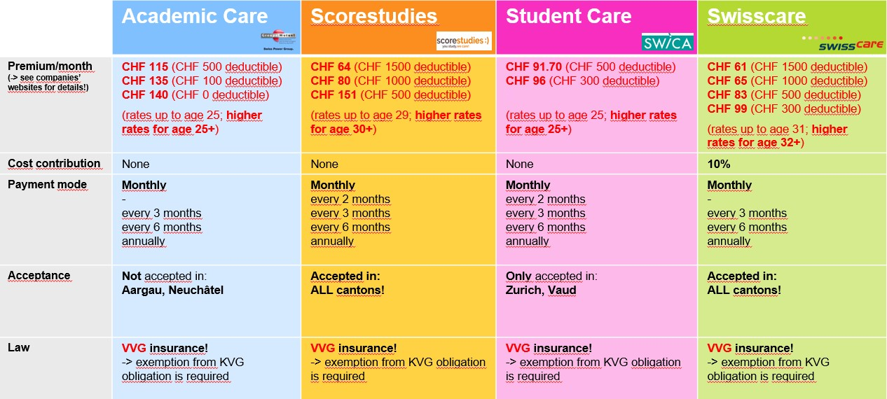
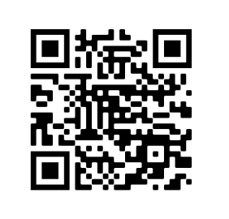

> [success] 本章作者：杨锦涛

以下信息资料主要来自ETH官网相关页面以及Swisscare FAQ页面

> <https://swisscare.com/zh/product/ruishiguojixueshengjiankangbaoxian>
>
> <https://ethz.ch/de/studium/international/nach-ankunft/krankenversicherung/faq-krankenversicherung.html>
>
> <https://ethz.ch/de/studium/international/nach-ankunft/krankenversicherung/non-eu.html>
>
> <https://ethz.ch/de/studium/international/nach-ankunft/krankenversicherung/befreiung.html>
>
> <https://ethz.ch/en/studies/international/after-arrival/health-insurance.html>

^

#### **1. 瑞士强制保险义务（VVG/KVG）介绍**

* **什么是VVG和KVG**？
  VVG = Versicherungsvertragsgesetz = 瑞士保险合同法
  KVG = Bundesgesetz über die Krankenversicherung = 瑞士医保法
* **健康保险在瑞士是强制性的吗**？
  是的。任何在瑞士逗留超过3个月的人都必须购买健康保险。确保你有足够的保险是你自己的责任。
* **如果我在3个月内没有购买学生健康保险（VVG）会怎样**？
  你将被强制投保，也就是说，你将被当局分配到一个瑞士健康保险基金（KVG）。这时，每月的保险费通常是**几百瑞士法郎**——不要错过入境3个月内的VVG购保及KVG豁免期限！
* **如果我在3个月后才投保健康保险，我可以省钱吗**？
  不能，保险合同必须追溯到入境之日。   
* **如果我在购买健康保险之前生病或发生事故会怎样**？
  你在事故/疾病发生后选择的保险将追溯到你入境之日。所有的健康保险公司都有义务将你纳入基本保险，而无需进行健康检查。如果你想购买学生保险套餐（根据VVG），我们建议你在抵达后尽快办理。
* **我可以在出发前申请瑞士健康保险吗**？
  不可以，你应该等到你到达瑞士并得到了人口登记办公室的住址申报确认函（Meldebestätigung）（详见[本篇《办理“迁入”》章](办理“迁入”（首次住址申报）.md)）之后再申请。然后，你居住地的主管部门会通知你医疗保险的义务。
  如果你住在苏黎世市区，当你在人口登记办公室申报住址时，你会收到一封关于苏黎世强制医疗保险的信息函。请遵循信中的指示。请参考样本信:attachment[sample-letters.pdf]{src=".topwrite/assets/sample-letters.pdf" size="1.75 MB"}
  如果你住在苏黎世郊区，程序因市镇的不同而不同。当你在人口登记办公室申报住址并申请居留证的时候，你也应该询问那里关于医疗保险的通常程序。
* **我想了解更多关于瑞士医疗保险的信息。我在哪里可以得到更多信息**？
  联邦公共卫生局提供了一本内容非常丰富的手册：
  :attachment[broschuere-sie-fragen-wir-antworten-d.pdf]{src=".topwrite/assets/broschuere-sie-fragen-wir-antworten-d.pdf" size="377.12 kB"}

^

#### **2. 国际学生的保险选择——VVG保险**

**是否有实惠的学生保险套餐可供选择**？

有的，有几家公司以合理的价格为国际学生提供**VVG保险**套餐。要了解更多信息，请访问[ETH国际学生健康保险网页](https://ethz.ch/de/studium/international/nach-ankunft/krankenversicherung/non-eu.html#par_textimage_1480546543)。如果你不确定，你可以联系[交流办公室](https://ethz.ch/de/studium/non-degree-angebote/austausch-und-gaststudium.html)（如果你是交流生）或[国际学生办公室](https://ethz.ch/de/studium/international.html)（如果你是本科生或硕士生）。

^

！！国际学生的健康保险套餐不是根据 "联邦健康保险法"（KVG）运作的，而是根据 "联邦保险合同法"（VVG）。因此，[你必须在投保后申请豁免KVG强制健康保险](https://ethz.ch/en/studies/international/after-arrival/health-insurance/nicht-eu.html)！！

> The health insurance packages for international students do not operate under the Federal Health Insurance Act (KVG), rather according to the "Federal Insurance Contract Act" (VVG) law. Therefore, in case you **take one of the packages**, you must [apply for an "exemption from the Swiss health insurance obligation](https://ethz.ch/de/studium/international/nach-ankunft/krankenversicherung/befreiung.html) according to the KVG law".

^

**套餐对比**：

**各产品具体报价可在ETH相关网站查看**：

<https://ethz.ch/en/studies/international/after-arrival/health-insurance/nicht-eu.html>

^

#### **3**. **购买VVG保险**，**豁免KVG保险**

> <https://ethz.ch/de/studium/international/nach-ankunft/krankenversicherung/befreiung.html>

**抵达瑞士后3个月内**，你需要购买VVG学生保险**并**申请豁免KVG保险。

^

**具体豁免步骤**，请见[上述网页](https://ethz.ch/en/studies/international/after-arrival/health-insurance/exemption.html)第2.B.项：

With a new Swiss Student Health Insurance without income

^

**提交豁免申请后**

你必须在到达瑞士后3个月内提交豁免申请。但是，你不一定要在3个月内收到关于豁免的最终决定。通常情况下，决定会晚一些。在这段时间内，如果你已经购买了瑞士学生健康保险，你仍然是被保险人，必须支付保险费。

如果你居住的城市胁迫你购买昂贵的KVG保险，请与ETH联系。

^

**豁免的期限**

豁免期为3年，确切的日期可以在你的确认信中找到，你会通过电子邮件从卫生局收到。请在你的日历上记下这个日期，并确保你在第一个豁免期到期之前申请新的豁免，申请程序是一样的。豁免的最长期限是6年。6年后，你将不得不购买 “正常”的KVG保险。

^

> **我在3个月前申请豁免强制健康保险，但仍未收到决定。我必须做什么**？
> 请等待。在处理豁免申请方面有很大的延迟——可能需要9个月的时间才会收到答复，请等待！如果你被居住地的市政府威胁要参加昂贵的KVG保险，请联系ETH。
>
> **我必须在3个月内收到关于豁免强制保险的决定吗**？
> 不，你只需要在入境后3个月内申请豁免。在大多数情况下，决定会晚一些。在这段时间内，你仍然有保险，而且还必须支付保险费（如果你已经购买了学生保险）。

^

#### **4**. **保险免赔额与共付额**

> <https://swisscare.com/zh/product/ruishiguojixueshengjiankangbaoxian>

**免赔额**：

免赔额，又名deductible，在所选**免赔额的限额内**，保单持有人必须**自费支付**医疗服务费用。一年内如果医疗报销金额累积超出免赔额，**超出部分**将由保险公司支付（但我们仍需要支付共付额，具体请见下方“共付额”解释）。保险**免赔额**会在保险单上注明。**免赔额越高，保险费越低**。
免赔额从每年1月1日起从0开始，持续累积一年。第二年将重新从0开始累积。

^

**共付额**：

当该日历年的累积报销金额超出免赔额后，保险公司将负担超出部分的费用，但该部分费用**依然需要我们支付10**%，每个日历年**上限为700瑞士法郎**。我们共付**超过700瑞郎后**，剩余费用将**完全**由保险公司支付。

注：**共付额**从每年1月1日起从0开始，持续累积一年。第二年将重新从0开始累积。

^

每个日历年，医疗报销费用将首先计入免赔额（全自付）。累积超出免赔额后，将进入共付额（10%）阶段（保险公司报销90%）。受保人共付额支出累积达到700瑞郎后，之后的医疗费用才会由保险公司完全报销。

> 关于共付额的瑞士联邦法规条款：<https://www.bag.admin.ch/bag/en/home/versicherungen/krankenversicherung/krankenversicherung-versicherte-mit-wohnsitz-in-der-schweiz/praemien-kostenbeteiligung/kostenbeteiligung.html>

^

#### **5**. **学联专属Swisscare折扣及福利**！

> <https://forum.acssz.org/d/51-swisscarebao-xian-guideline-da-yi-he-xue-lian-zhe-kou>

Swisscare作为苏黎世学联的长期合作伙伴，在ETH和Swisscare官网价格基础上（最低61瑞郎/月起），为苏黎世学联的所有同学提供**额外的5%学联专属折扣**。如此，就在原本就很优惠的基础上，再便宜了5%，保费最低**58瑞/月**起。

^

你可选择扫描以下二维码或者访问下方网址进入**学联专属入保通道**享受特别折扣！

**学联专属优惠二维码**：

**学联专属优惠链接**：
<https://forms.swisscare.com/#/spss?group=3018>

^

**注意**：请务必通过**专属优惠链接**或**二维码**入保，否则无法识别为学联会员且无法获得学联优惠。如您已自行购保，请将您的保险Policenummer和情况说明（附上电子学联卡截图）发送给<switzerland@swisscare.com>申请转为学联会员入保）

^

此外，**Swisscare特意为所有中国同学准备了中文版的保险Guidline**，以便大家轻松理解并解决保险相关难题：:attachment[acssz-zurich-guideline-zh-cn-12-2022.pdf]{src=".topwrite/assets/acssz-zurich-guideline-zh-cn-12-2022.pdf" size="515.28 kB"}

^

学联长期与Swisscare保持密切沟通，及时反馈同学们的问题和困难，协助提升Swisscare的服务品质。

> 附录：瑞士留学生基础医疗保险投保指南——SWISSCARE
>
> <https://mp.weixin.qq.com/s/bNqfac6lQLKp9KLMG8az0Q>

^

#### **6. 如何找到自己的AHV编号**

ETH同学可在<http://mystudies.ethz.ch/>个人信息栏（Personal information/Persönliche Angaben）中找到自己的AHV编号；UZH同学可以通过contact form（<https://www.uzh.ch/en/studies/dates/adresses/email.html>）咨询学校，或咨询保险公司

^

#### **7**. **其它补充保险（非强制**）

关于责任险（Liability）和房屋险（Household）的说明请见：<https://forum.acssz.org/d/948>

关于口腔医疗额外保险，分为两种情况：

* 如果牙齿已经有问题了，则很难购买口腔医疗额外保险（没有公司愿意承保）
* 如果牙齿没有问题，则需要提供医生签发的牙医检查证明（zahnärztliches Zeugnis）、X光片（Röntgenbilder）且事实上口腔确没有问题，只有这样才有保险公司愿意评估并提供口腔额外险

对于责任险、房屋险以及口腔额外险，如你希望进一步咨询相关内容，可联系学联保险顾问伙伴JC Insurances的个人客户咨询服务Easyinsured：<https://easyinsured.ch/>

^
