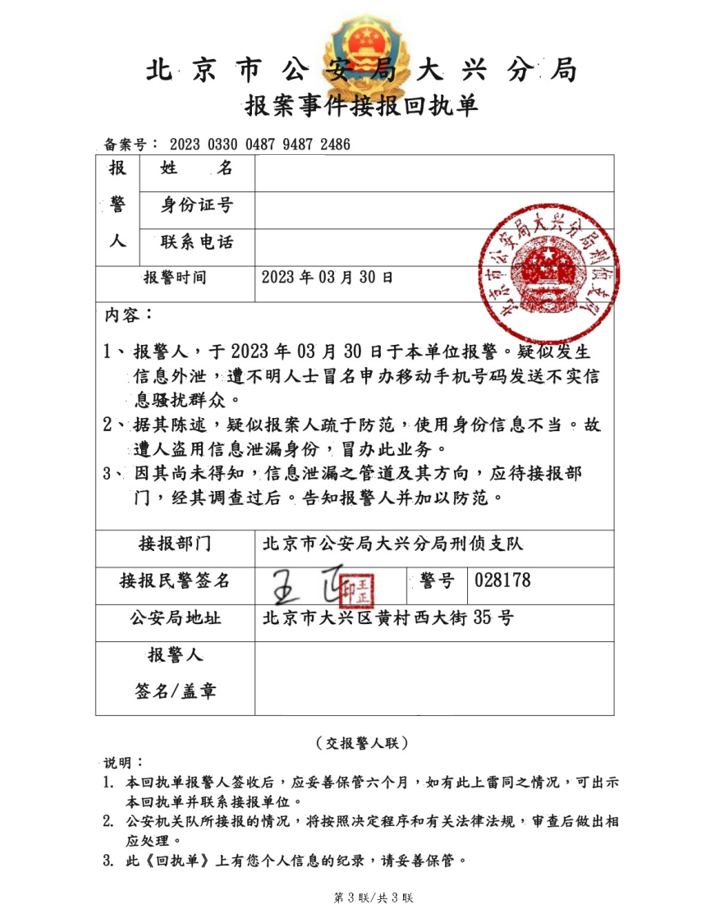
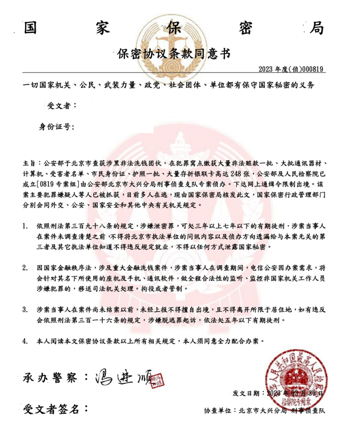
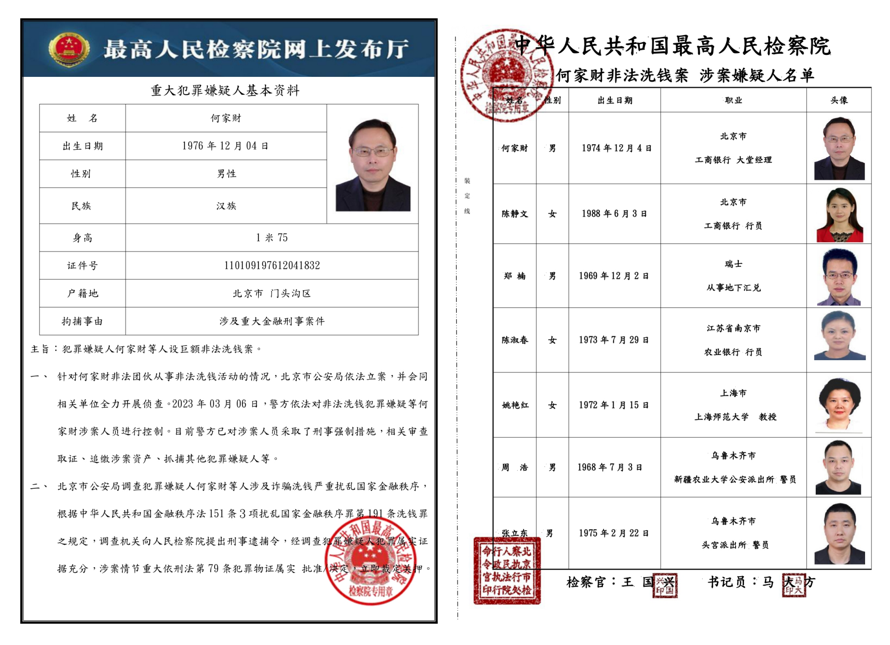

> [success] 本章作者：赵逸飞

> [success] 特别鸣谢：中国驻苏黎世总领馆

> [info] *如你在瑞士经历过诈骗的，欢迎将相关经历通过*<info@acssz.org>*分享给我们，或在*[学联论坛](https://forum.acssz.org/)*中分享，以帮助更多同学识破诈骗分子的阴谋*。

### **1. 在瑞常见诈骗手段的介绍、识别与预防**

#### **1.1 私下换汇相关诈骗**

> [danger] 【***学联提醒】无论是在中国还是在瑞士，私下换汇行为都可能涉嫌违法；如有犯罪分子利用私下换汇行为进行洗钱活动的，换汇人还可能涉嫌犯罪，需要追究刑事责任（参考***：[《留学生私下换汇被判刑 哪些行为涉嫌“洗钱”？》](https://lx.huanqiu.com/article/9CaKrnK9SJX)）；***请自行斟酌有关风险***！！！

* **诈骗方式**： 线下诈骗，“物理”跑路
* **诈骗团伙**： 欧洲当地的诈骗团伙（多为华人）
* **案例汇总**：
  （*可参考*[学联论坛换汇预警帖](https://forum.acssz.org/d/72-ti-xing-si-xia-huan-hui-da-e-jiao-yi-xu-jin-shen)）
  【案例一】张三同学在微信群里看到有人“出瑞郎”，便与其约定换汇。换汇时，张三向其微信转账后对方跑路，诈骗遂得逞。
  【案例二】李四同学在群里看到有人“出人民币”，便与其约定换汇。换汇时，李四交给对方现金后对方以“手机网络故障”“需要立即出差”等理由拖延转账（或向李四展示伪造的转账截图），后失联，对方诈骗遂得逞。
  【案例三】王五同学在群里看到有人“出人民币”，便与其约定换汇。换汇时，对方持刀威胁王五要求交出身上现金，王五为保证自身安全照办，后对方离开。对方诈骗（实为抢劫）遂得逞。
* **风险预防**：
  1\). 尽可能**避免私下换汇行为**，而是选择银行换汇等正规手段！！！
  2\). 如实在无法避免私下换汇的，尽可能**与“知根知底”的人（而非陌生人）交易**
  3\). 如实在无法避免与陌生人交易的，尽可能**提前验证其身份，确保其可靠**（有条件的尽量采用交叉验证）
  4\). 赴约换汇时，**避免单独前往**
  5\). 选择换汇地点时，尽量选择人流量大/有监控探头的地方
  6\). 在任何情况下，不要向陌生人透露自己的住址，也不要向陌生人透露自己的银行账户信息
  7\). 如遭遇诈骗/抢劫，请第一时间报警

#### **1.2 “天上掉黑锅”类 / “无辜失联”类**

> [danger] 【***学联提醒】 在任何情况下，驻瑞士使领馆和快递公司都不会介入办案，也不会电话通知涉案，更不会提供向公安部门转接电话的“服务”。同时，国内长期以来大力宣传的”96110电话一定要接“在国外并不适用***。

* **诈骗方式**： 电话诈骗
* **诈骗团伙**： 中国台湾、缅甸、柬埔寨等地的诈骗团伙
* **案例**：
  【第一阶段】张三同学接到+86 10 96110来电，对方自称“广州反诈中心”，在向张三科普了一些反诈知识和后，称张三名下有一张在北京大兴国际机场的中国移动营业厅办理的电话卡涉嫌违法犯罪。在张三否认办理过该张电话卡后，“广州反诈中心”表示张三的身份被不法分子冒用，要求张三报案，并替张三将电话转接到“北京市公安局大兴分局刑侦支队”。期间，张三对“广州反诈中心”使用+86 10的区号提出质疑，“广州反诈中心”表示这是由于向境外呼叫而使用的统一号码，张三遂相信之。
  【第二个平行时空的第一阶段】张三同学接到“中国驻瑞士使馆”/“中国驻苏黎世总领馆”/“DHL客服中心”（下简称“来电方”）来电，称张三因向国内寄送的包裹被查出含有违禁品而涉嫌违法。在张三否认寄送过该包裹后，来电方表示张三的身份被不法分子冒用，要求张三报案，并替张三将电话转接到“北京市公安局大兴分局刑侦支队”。期间，张三对“广州反诈中心”使用+86 10的区号提出质疑，“广州反诈中心”表示这是由于向境外呼叫而使用的统一号码，张三遂相信之。
  【第二阶段】电话转接后，一位“王警官”为张三通过Skype进行了笔录，并出具了《报案事件接报回执单》。
  期间，张三对公安部门使用Skype软件办案提出质疑，“王警官”表示该举措是为了方便海外群众配合调查。随后，“王警官”提出要帮助张三查询一下张三是否有其他身份被冒用的情况，要求张三提供身份证号，张三接受，“王警官”便呼叫“总部”查询。后“总部”回话称有一张张三名下的银行卡涉嫌巨额洗钱，要求张三立刻配合调查。
  【第三阶段】
  此时，“王警官”的上级“冯队长”进入对话，称自己接到重大案件的警报，询问“王警官”情况，“王警官”便向“冯队长”汇报了关于“张三银行卡涉案”的情况，“冯队长”随即表示案件由他接管，开始审问张三，并要求张三签署《保密协议条款同意书》，称该案件属于“国家二级保密案件”。
  
  张三签署《同意书》后，“冯队长“给张三展示了这起”洗钱案“的”主要涉案嫌疑人名单“请张三指认，张三表示不认识其中的任何一个人。”冯队长“表示，所有”涉案嫌疑人“均指认，张三通过向其出售银行卡获利，目前没有任何对张三有利的证据，并给予张三一天的时间，要求其仔细回想与”名单“中的”嫌疑人“是否有过交集并写一份《自白书》。期间，张三按“冯队长“要求，所有行为受其监听监视。
  
  【第四阶段】
  第三天，在张三否认后，“冯队长”并向”负责检察官“对话申请”境外资金清查“。”冯队长“将电话转给”检察官“，同时向“检察官”提交了张三的《自白书》。”检察官“和张三简要了解情况，随后便将”冯队长“召进电话，表示会给”冯队长“下一份公文，让”冯警官“依公文处理。”冯队长“收到公文后，告知张三该公文是一张对张三的《刑事拘捕令》并向张三展示之。”冯队长“表示极为惊诧，但又表示其感觉张三也是被害人，因此愿意帮助张三通过暂时压住这份《拘捕令》不发的方式与”检察官”周旋。第四天，”冯队长“表示依然在想办法帮助张三。
  【第五阶段】
  张三感觉事情反常，便开始查阅相关资料，在致电真正的北京市公安局大兴分局后确定是遭遇了电信诈骗，幸无财产损失。
  【第二个平行时空的第五阶段】
  “冯队长”表示，在其向”负责检察官“反复保证后，”负责检察官“同意对张三免于逮捕，但需要张三缴纳5000瑞郎的保证金以保证全程配合调查。张三为避免遭到逮捕，根据”冯队长“提供的渠道向其转账，后”冯队长“失联，诈骗行为得逞。
  【第三个平行时空的第五阶段】
  （参考：[知乎专栏文章《博士后被骗了，电信诈骗，29万……》](https://zhuanlan.zhihu.com/p/64152663)）
  “冯队长”表示，为了确认张三不涉案，需要对其名下账户内的资金进行清查，为此要求张三前往指定网站/下载指定app并输入银行账号和密码，同时要求张三在网贷平台按最大额度贷款以防犯罪分子冒充其身份进行贷款。后，“冯队长”称张三账户中莫名多出一笔存款，怀疑是【第三阶段】中的嫌疑人向其转账的赃款，故要求张三将这笔存款“取出再存入”以供验证。（后查明，骗子利用该手段使用张三身份实施贷款）
  后，“冯队长”表示，该笔存款署“来历不明”，不能为张三洗清嫌疑，故需要向账户内存入26.8万元人民币以证明张三没有作案动机，后“冯队长”失联。（因该账户信息已完全被骗子掌握，该26.8万元人民币以及张三先前被“冒贷”的那笔存款遂被骗子骗得，诈骗行为得逞。）
  【第四个平行时空的第五阶段】
  “冯队长”的同伙向张三的父母致电，称张三被绑架，要求其父母支付赎金。同时，“冯队长”要求张三退出微信。此时因张三电话线路被“冯队长”占用导致其父母无法联系到他，客观上造成了张三失联，其父母便相信了张三被绑架，遂支付赎金，后“冯队长”等人失联，父母得知张三平安，诈骗行为得逞。
* **套路总结**：
  1\). 诈骗分子通过编造事实的方式，使受害人相信自己的身份存在被冒用的情况，并相信自己已经涉案（已经被“冤枉”），需要配合其调查（以恢复清白）
  2\). 诈骗分子以“案件保密”为由，对受害人实施监听监视，并在物理上隔绝受害人以避免其与外界取得联系
  3\). 诈骗分子利用“一个红脸（如前文的“冯队长”）一个白脸（如前文的“检察官）”等战术，通过伪造《拘捕令》等方式对被害人实施恐吓威胁以击溃其心理防线
  4\). 诈骗分子分工明确，极有耐心，以天为单位与受害者周旋，大有“放长线钓大鱼“之势
* **风险预防**：
  1\). 凡“天上掉黑锅“的，都是诈骗
  2\). 凡“反诈中心“”使领馆“”快递公司“等负责查案的，或是给予电话转接要求报警的，都是冒牌
  3\). “公检法“机关以保密为由实施物理隔绝的，实际上保的均为”被诈骗“的密（防止受害人将情况告知亲朋好友）而不是”案件“的密（因为所谓的”案件“根本不存在）
  4\). 凡“公检法”人员以“你虽然涉案，但你一直配合调查，我也不想让你的一生就这样毁掉，所以你的拘捕我先想办法压下来，你下面要配合我的工作”或类似言辞要求博取对方理解与信任的，一律是诈骗
  5\). 凡调查公文显得花里胡哨的（如，采用人民警察警徽，人民法院法徽，人民检察院检徽作为文章背景的，或是到处都有不同单位的印章的），都是诈骗
  6\). 凡调查公文的抬头，落款涉及单位不同的，都是诈骗
  7\). 凡调查公文引用法条错误的，都是诈骗
  8\). 凡调查公文使用任何内地不存在的法律术语的，都是诈骗
  9\). 凡国内科级、处级、局（厅）级单位使用国徽印章的，都是诈骗
  10\). 凡“公检法”人员口音与其所在地不符的（如北京警察操闽南口音），或使用一些仅在台湾地区流行的说法的，都是诈骗（前者需综合判断）

#### **1.3 机票相关诈骗**

> [danger] 【***学联提醒】在任何情况下，航司官网和正规OTA平台都比私人票代可靠。此外，奖励客票（俗称“里程票“）不允许通过航司官方以外渠道买卖***。

* **诈骗方式**： “收钱不出票”/“出具虚假客票”/违规出售里程票
* **诈骗团伙**： 私人票代
* **案例汇总**：
  【案例一】张三在某群中看到有票代宣传其低价的回国机票，遂联系之。在支付票款后，票代失联。
  【案例二】张三在某群中看到有票代宣传其低价的回国机票，遂联系之。在支付票款后，票代向其出具了行程单。出行当天，张三前往机场办理值机手续，被告知“没有客票信息”。后查明，行程单系伪造。
  【案例三】（参考：[微博@北美票帝的相关提醒](https://weibo.com/3043504277/4783653797757563)）张三在某群中看到有票代宣传其低价的回国机票，遂联系之。在支付票款后，票代向其出具了行程单。出行当天，张三前往机场办理值机手续，被告知航班超售，故被“踢“。后向票代申请退款时，票代以“航班未取消“等理由拒绝，后查明，该机票系里程票。
* **风险预防**：
  1\). 通过正规渠道（如航司官网、正规OTA平台）购票，避免从私人票代处购票
  2\). 如因特殊情况确需从私人票代处购票的，应确保该票代可靠
  3\). 在任何情况下，奖励客票（“里程票“）均不允许通过航司官方以外的渠道进行买卖。
  4\). 在购票后，前往航司官网通过输入电子客票号（一般为13位数字编码，[其中前三位代表出票航空公司](https://www.iata.org/en/about/members/airline-list/)）或预定编码（一般为6位字母数字混合编码）查验客票真实性。（如客票通过中航信系统填开的，航旅纵横应用能够自动导入，亦可辅助验证。）

#### **1.4 街头求助搭讪类**

> [danger] 【***学联提醒】在任何情况下都不要上陌生人的车***！！！

* **诈骗方式**： 线下诈骗
* **诈骗团伙**： 欧洲当地的诈骗团伙
* **案例汇总**：
  【案例】（“意大利SUV诈骗“，参考：[学联论坛意大利SUV诈骗预警贴](https://forum.acssz.org/d/58-suvitalian-suv-scam)）
  张三同学步行途中被一意大利牌照的SUV拦住，副驾以手机网络失效为由请张三查询前往机场的路线并拍照。后，以张三是中国人为由进行搭讪（如：“我老婆也是中国人“”我曾经在上海待过一段时间“等），并介绍自己是一名服装设计师，向张三推介自己的作品并请张三上车，张三欣然同意。上车后，副驾以各种理由（包括但不限于自己现金用尽需要帮助，出售小商品等）请张三向其付款。
* **风险预防**：
  1\). **在任何情况下都不要上陌生人的车**
  2\). 如有陌生人以“我老婆也是中国人“”我曾经在上海待过一段时间“或类似理由搭讪，立即提高警惕并做好离开准备

#### **1.5 租房相关诈骗**

*请参考*[16 云找房](<16 云找房.md>)*及*[24 找房租房](24找房租房.md)*章节*。

^
^

### **2. 遭遇诈骗后的处理**

如不幸遭遇诈骗，请及时前往案件发生所在地的警局报案，并按照警员指导提供相关信息。为避免浪费公共资源，在没有所谓“案发现场”和紧急情况时，不建议通过拨打紧急报警电话117或112报案；此外，ETH和UZH均提供低价的法律援助服务，必要情况下可以申请；具体请参考[报警和法律援助](报警和法律援助.md)章节。
此外，如诈骗行为在平台发生的（如，在租房平台网站上遇到“租房骗子”），亦可/应向平台进行举报。
